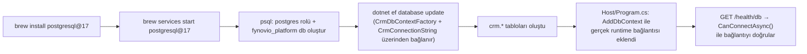

# .NET rehberi — Laravel'den gelenler için

Bu doküman iki şeyi anlatıyor: (1) .NET/ASP.NET Core ekosisteminin temel yapı taşları, Laravel'e aşina birinin zihin haritasıyla eşleştirilmiş; (2) bu repoda bugüne kadar kurduğumuz somut yapı — hangi dosya ne işe yarıyor, veritabanı bağlantısı nasıl akıyor.

Referans kod parçaları gerçek dosya yollarıyla veriliyor — bir şeyi anlamadığında o dosyayı aç, burada anlatılan yalnızca "neden böyle" kısmı.

---

## 1. Solution ve proje kavramı

Laravel'de tek bir proje köküne (`composer.json`, `app/`, `routes/`) alışkınsın. .NET'te iş iki katmanlı:

- **Solution** (`.sln` / bu repoda `.slnx`) — birden fazla projeyi bir arada tutan üst kapsayıcı. Kod içermez, sadece hangi projelerin bir arada derlendiğini listeler.
- **Proje** (`.csproj`) — Laravel'deki tek bir Composer paketine benzer: kendi bağımlılıkları, kendi derleme ayarları, kendi çıktısı (`.dll`) olan bağımsız bir birim.

`fynovio-platform.slnx` dosyasına bakarsan (repo kökünde), 8 proje listelendiğini görürsün — her biri ayrı bir `.csproj`. Laravel'de bu, "bir repo içinde 8 ayrı Composer paketi, her biri kendi `composer.json`'ıyla, birbirlerine sadece belirli arayüzlerden bağımlı" gibi düşünülebilir.

```
src/Contracts/Contracts.csproj
src/Host/Host.csproj
src/Worker/Worker.csproj
src/Modules/CRM/CRM.csproj
src/Modules/Access/Access.csproj
src/Modules/MasterData/MasterData.csproj
src/Modules/Organization/Organization.csproj
src/Modules/TenantLifecycle/TenantLifecycle.csproj
```

Bir `.csproj` içinde neler var, örnek olarak `src/Modules/CRM/CRM.csproj`:

```xml
<ItemGroup>
  <ProjectReference Include="..\..\Contracts\Contracts.csproj" />   <!-- başka bir projeye bağımlılık -->
</ItemGroup>
<ItemGroup>
  <PackageReference Include="Npgsql.EntityFrameworkCore.PostgreSQL" Version="10.0.3" />  <!-- composer require gibi, NuGet paketi -->
</ItemGroup>
<PropertyGroup>
  <TargetFramework>net10.0</TargetFramework>   <!-- hangi .NET sürümüne derleneceği -->
  <Nullable>enable</Nullable>                  <!-- null-safety analizini aç -->
</PropertyGroup>
```

`<ProjectReference>` = "bu paket, o paketi require ediyor" (Composer'daki path repository gibi).
`<PackageReference>` = `composer require vendor/paket` karşılığı — NuGet.org'dan (Composer'ın Packagist'i) çekilir.

**Neden bu kadar çok proje?** Çünkü bu repo bir "modüler monolit" — her modül fiziksel olarak ayrı bir derleme birimi, böylece "CRM modülü, Access modülünün iç sınıflarına asla erişemez" kuralı derleyici seviyesinde zorlanıyor (referans yoksa erişim de yok). Laravel'de bunu genelde disiplin/convention ile sağlarsın; burada derleyici sağlıyor.

---

## 2. Proje tipleri — bu repoda kullanılan üç farklı "SDK"

Her `.csproj`'un tepesinde `<Project Sdk="...">` yazar, bu projenin *türünü* belirler:

| SDK | Bu repodaki örnek | Ne işe yarar | Laravel karşılığı |
|---|---|---|---|
| `Microsoft.NET.Sdk` | `Contracts`, tüm `Modules/*` | Sade class library — HTTP dinlemez, kendi başına çalışmaz | `composer create-project` ile oluşturduğun bir paket, framework'süz |
| `Microsoft.NET.Sdk.Web` | `Host` | ASP.NET Core web uygulaması — HTTP sunucusu gömülü | Laravel'in kendisi (`public/index.php` + Kernel) |
| `Microsoft.NET.Sdk.Worker` | `Worker` | Arka planda sürekli çalışan servis (`BackgroundService`) | `php artisan queue:work` sürekli çalışan bir process gibi, ama kendi başına deploy edilen ayrı bir uygulama |

`Host` ve `Worker`'ın ikisi de **çalıştırılabilir** (`dotnet run` ile ayağa kalkarlar), diğerleri (Contracts, Modules) sadece **referans edilebilir** kütüphaneler — tek başlarına çalıştırılamazlar, bir "Host" ya da "Worker" onları içine alıp kullanmalı.

---

## 3. `Program.cs` — composition root, yani "her şeyin bağlandığı yer"

Laravel'de `bootstrap/app.php` + service provider'lar neyse, .NET'te `Program.cs` o. Bu dosya, ASP.NET Core 6+'dan beri "top-level statements" denen bir stille yazılır — `class Program { static void Main() }` boilerplate'i yok, direkt kod:

```csharp
// src/Host/Program.cs — bugün eklediğimiz hali
using CRM.Persistence;
using Microsoft.EntityFrameworkCore;

var builder = WebApplication.CreateBuilder(args);   // Laravel'in bootstrap aşaması

builder.Services.AddDbContext<CrmDbContext>(options => options
    .UseNpgsql(
        builder.Configuration.GetConnectionString("Crm") ?? CrmConnectionString.Resolve(),
        npgsql => npgsql.MigrationsHistoryTable("__ef_migrations_history", CrmDbContext.Schema))
    .UseSnakeCaseNamingConvention());
// ↑ Laravel'de: config/database.php + AppServiceProvider::register()'da bir binding yapmaya benzer

var app = builder.Build();

app.MapGet("/", () => "Hello World!");                       // routes/web.php'deki Route::get gibi
app.MapGet("/health/db", async (CrmDbContext db, CancellationToken ct) =>
    await db.Database.CanConnectAsync(ct) ? Results.Ok("crm db reachable") : Results.StatusCode(503));

app.Run();   // php artisan serve'ün başlattığı şeyin kendisi, ama gömülü sunucu üretimde de kullanılabilir
```

Üç aşama var:
1. **`builder`** — ayarları topluyorsun (DI kayıtları, konfigürasyon kaynakları). Laravel'de `register()` metodlarının olduğu aşama.
2. **`builder.Build()`** — artık uygulama "donduruldu", DI container hazır.
3. **`app.MapGet(...)` / `app.Run()`** — route tanımlama ve sunucuyu başlatma. Laravel'de `routes/web.php` + `php artisan serve`.

`builder.Services.AddDbContext<T>(...)` satırı, .NET'in yerleşik **Dependency Injection container**'ına bir kayıt ekliyor — Laravel'in Service Container'ındaki `$this->app->bind(...)`'in framework tarafından zaten kurulmuş, "otomatik constructor injection yapan" hali. `/health/db` endpoint'indeki `(CrmDbContext db, ...)` parametresi, container'dan otomatik enjekte ediliyor — sen hiçbir yerde `new CrmDbContext(...)` yazmıyorsun, tıpkı Laravel'de bir controller metodunun parametresine `Request $request` yazman gibi.

---

## 4. Entity Framework Core — Eloquent'in .NET karşılığı

| Laravel / Eloquent | .NET / EF Core |
|---|---|
| Model sınıfı (`class Party extends Model`) | Entity sınıfı (`src/Modules/CRM/Domain/Party.cs`) |
| `DB::connection()` + model registry | `DbContext` (`src/Modules/CRM/Persistence/CrmDbContext.cs`) |
| Eloquent Collection / `Party::query()` | `DbSet<Party>` |
| `php artisan make:migration` | `dotnet ef migrations add` |
| `database/migrations/*.php` | `src/Modules/CRM/Persistence/Migrations/*.cs` |
| `$fillable`, `$casts`, ilişki tanımları model içinde | Ayrı bir `*Configuration.cs` dosyasında Fluent API (`Persistence/Configurations/`) |
| `php artisan migrate` | `dotnet ef database update` |

`CrmDbContext.cs`'e bakınca:

```csharp
public sealed class CrmDbContext : DbContext
{
    public const string Schema = "crm";   // Laravel'de yok — Postgres'te ayrı bir "schema" (isim alanı) kullanıyoruz

    public DbSet<Party> Parties => Set<Party>();
    public DbSet<Opportunity> Opportunities => Set<Opportunity>();
    // ...

    protected override void OnModelCreating(ModelBuilder modelBuilder)
    {
        modelBuilder.HasDefaultSchema(Schema);
        modelBuilder.ApplyConfigurationsFromAssembly(typeof(CrmDbContext).Assembly);
    }
}
```

`DbSet<Party>` = "parties tablosuna Eloquent-benzeri bir kapı". `ApplyConfigurationsFromAssembly` ise Laravel'de olmayan bir desen: her entity'nin sütun/ilişki/constraint tanımı, entity'nin kendisinde değil, ayrı bir `PartyConfiguration.cs` dosyasında yaşıyor (Fluent API ile). Bu, "modelin kendisi framework detaylarından bağımsız kalsın" prensibinden geliyor.

**Neden şema (schema) başına bir modül?** Laravel'de tek bir `public` şeması kullanırsın. Burada her modülün (`CRM`, `Access`, ...) kendi Postgres şeması var (`crm.*`, `access.*` gibi) — bu, "modüller birbirinin tablosuna asla direkt SQL ile dokunamaz" mimari kuralının veritabanı seviyesindeki karşılığı.

---

## 5. Migration'lar: `dotnet ef` akışı

```bash
dotnet ef migrations add InitialCrmSchema \
  --project src/Modules/CRM/CRM.csproj \
  --startup-project src/Modules/CRM/CRM.csproj \
  --output-dir Persistence/Migrations
```

Bu komut üç dosya üretir (`src/Modules/CRM/Persistence/Migrations/` altında):
- `<timestamp>_InitialCrmSchema.cs` — `Up()`/`Down()` metodları, Laravel migration'ındaki `up()`/`down()` ile birebir aynı fikir.
- `<timestamp>_InitialCrmSchema.Designer.cs` — EF'in iç kullandığı metadata, elle dokunulmaz.
- `CrmDbContextModelSnapshot.cs` — "şu an modelin tamamı böyle görünüyor" anlık görüntüsü; bir sonraki migration'ı üretirken EF bunu önceki durumla kıyaslar. Laravel'de doğrudan karşılığı yok (Laravel her migration dosyasını sırayla çalıştırır, ayrı bir "güncel model" dosyası tutmaz).

`--project` ve `--startup-project` neden ayrı ayrı veriliyor, çünkü büyük projelerde migration'ların tanımlandığı proje ile uygulamanın gerçek başlangıç noktası (DI, config) farklı olabilir. Burada ikisi de CRM projesinin kendisi çünkü henüz `Host` üzerinden migration çalıştırmıyoruz.

**Migration nasıl uygulanır (Postgres'e gerçekten yazılır)?**

```bash
dotnet ef database update --project src/Modules/CRM/CRM.csproj --startup-project src/Modules/CRM/CRM.csproj
```

Bu komut `php artisan migrate`'in birebir karşılığı — ama hangi veritabanına bağlanacağını bilmesi lazım, sıradaki bölüm bunu anlatıyor.

---

## 6. Bağlantı dizesi (connection string) nereden geliyor — bugün kurduğumuz yapı

Laravel'de tek bir `.env` dosyası + `config/database.php` var. .NET'te **iki farklı an** için **iki farklı yol** var, ve bunları bugün birleştirdik:

### a) Design-time (migration komutları çalışırken)

`dotnet ef` komutları çalıştığında henüz gerçek uygulama (Host) ayağa kalkmıyor — `dotnet ef`'in DB'ye nasıl bağlanacağını bilmesi için ayrı, küçük bir "fabrika" sınıfı lazım:

```csharp
// src/Modules/CRM/Persistence/CrmDbContextFactory.cs
public sealed class CrmDbContextFactory : IDesignTimeDbContextFactory<CrmDbContext>
{
    public CrmDbContext CreateDbContext(string[] args)
    {
        var optionsBuilder = new DbContextOptionsBuilder<CrmDbContext>();
        optionsBuilder.UseNpgsql(CrmConnectionString.Resolve(), ...);
        return new CrmDbContext(optionsBuilder.Options);
    }
}
```

### b) Runtime (uygulama gerçekten çalışırken — `Host`)

```csharp
// src/Host/Program.cs
builder.Services.AddDbContext<CrmDbContext>(options => options
    .UseNpgsql(builder.Configuration.GetConnectionString("Crm") ?? CrmConnectionString.Resolve(), ...));
```

### c) İkisinin de kullandığı ortak varsayılan

İki yolun da aynı "yerelde hiçbir şey ayarlamamışsan şu değeri kullan" mantığını tek yerden almasını istedik (aksi halde `postgres/postgres` şifresi iki dosyada ayrı ayrı hardcoded kalırdı):

```csharp
// src/Modules/CRM/Persistence/CrmConnectionString.cs
public static class CrmConnectionString
{
    private const string LocalDevDefault =
        "Host=localhost;Database=fynovio_platform;Username=postgres;Password=postgres";

    public static string Resolve() =>
        Environment.GetEnvironmentVariable("FYNOVIO_CRM_CONNECTION_STRING") ?? LocalDevDefault;
}
```

**Öncelik sırası, Host çalışırken:**
1. `builder.Configuration.GetConnectionString("Crm")` — yani `appsettings.json`'daki `ConnectionStrings:Crm` anahtarı, ya da onu ezen bir env var (`ConnectionStrings__Crm`), ya da User Secrets.
2. Hiçbiri yoksa → `CrmConnectionString.Resolve()` → `FYNOVIO_CRM_CONNECTION_STRING` env var'ı.
3. O da yoksa → yerel geliştirme varsayılanı (`localhost`, `postgres/postgres`).

Şu an (b) ve (c)'nin hiçbiri ayarlı değil, yani Host, kurduğumuz yerel Postgres'e otomatik olarak varsayılan değerle bağlanıyor — bilinçli bir tasarım: **local-only** aşamada olduğumuz için (bkz. proje notu) hiçbir ek konfigürasyona gerek kalmadan çalışıyor, ama gün gelip production'a geçince tek yapman gereken `ConnectionStrings__Crm` env var'ını set etmek — kod hiç değişmeyecek.

---

## 7. Konfigürasyon katmanları — `.env` yerine ne var

.NET'in konfigürasyon sistemi katmanlıdır, sonraki katman öncekini ezer:

1. `appsettings.json` — her ortamda geçerli, hassas olmayan ayarlar (repo'ya girer).
2. `appsettings.{Environment}.json` (örn. `appsettings.Development.json`) — ortama özel override (repo'ya girer, yine hassas veri olmamalı).
3. **User Secrets** (sadece Development) — `dotnet user-secrets set`, kullanıcı profilinde durur, **repo'ya hiç girmez**. Laravel'in ".env'i gitignore'la" alışkanlığının en yakın karşılığı.
4. **Ortam değişkenleri** — CI/CD ve production'da asıl kullanılan yol; `ConnectionStrings__Crm` gibi `__` ile iç içe anahtarları temsil eder.
5. Komut satırı argümanları.

Bu repoda şu an: (1) ve (2) sadece logging ayarı içeriyor, (3) hiç kurulmamış, (4) `FYNOVIO_CRM_CONNECTION_STRING` adıyla opsiyonel olarak destekleniyor. `.env` dosyası .NET'te idiomatic değil — biri `DotNetEnv` gibi bir pakete sarılıp kullanabilir ama ekosistemin beklediği yol User Secrets + env var ikilisi.

---

## 8. Uçtan uca akış — bugün ne oldu



Yani zincir şöyle: Postgres kurulumu → rol/DB oluşturma → migration ile şema oluşturma → Host'un artık gerçekten bu DB'ye bağlanabilmesi için DI kaydı → doğrulama endpoint'i.

---

## 9. Hızlı sözlük

| Terim | Laravel karşılığı / kısa açıklama |
|---|---|
| `.csproj` | `composer.json` |
| `.sln` / `.slnx` | Yok — birden fazla Composer paketini tek repoda gruplayan üst dosya |
| NuGet | Packagist / Composer registry |
| `Program.cs` | `bootstrap/app.php` + `routes/web.php` birleşimi |
| `builder.Services.AddX` | Service Container binding (`$this->app->bind`) |
| `DbContext` | Eloquent'in bağlantı+model registry karşılığı |
| `DbSet<T>` | `Model::query()` |
| Migration (`.cs`) | `database/migrations/*.php` |
| `*Configuration.cs` (Fluent API) | Model içindeki `$fillable`/`$casts`/ilişki tanımları, ayrı dosyaya çıkarılmış hali |
| `dotnet ef database update` | `php artisan migrate` |
| `appsettings.json` | `config/*.php` |
| `appsettings.Development.json` | `.env.local` benzeri, ortama özel override |
| User Secrets | ".env'i gitignore'lamak"ın .NET'teki resmi karşılığı |
| Minimal API (`app.MapGet`) | `Route::get(...)` |
| `record` / `record struct` | Değişmez (immutable) DTO — Laravel'de karşılığı yok, en yakini bir `readonly` PHP sınıfı |
| Modüler monolit | Tek deploy birimi ama modüller arası erişim derleyici seviyesinde kısıtlı — Laravel'de "her paket ayrı bir Composer paketi olsaydı" gibi düşün |

---

## Daha fazla okuma (bu repoda)

- `AGENTS.md` — mimari kurallar, neden bu şekilde bölündüğü
- `docs/schema/crm-sales-schema.md` — CRM modülünün fiziksel şema tasarımı
- `README.md` — kurulum adımları (Postgres + migration)
