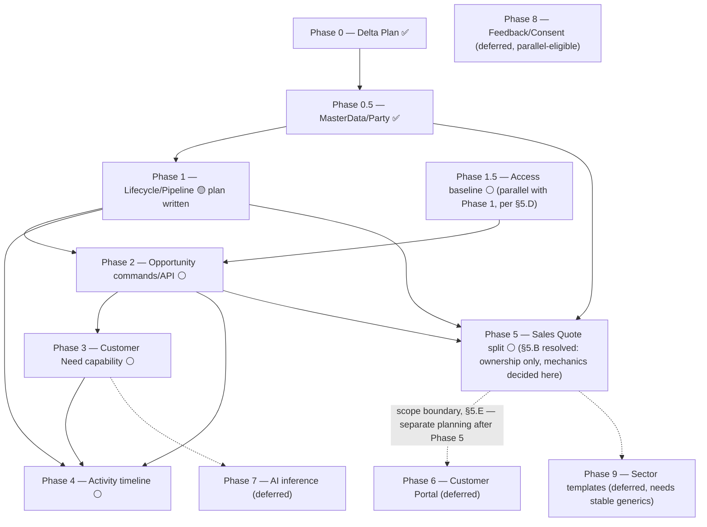

# CRM Target Model — Phase 0 Delta Plan

> **Status:** planning artifact, no code changed. This is Phase 0 of
> `docs/architecture-analysis/Enterprise_CRM_Target_Model_Binding_Implementation_Specification.pdf`
> Section 21 ("Inspect and Plan") and follows its Section 24 execution protocol for a
> coding agent: inventory current code, produce a decision matrix, list assumptions
> the spec doesn't resolve, and stop before writing any code that would require
> changing a frozen decision.
>
> **Do not start Phase 1 from this document alone.** Section 5 below lists open
> questions that must be answered by the platform owner first. Once answered, this
> file gets a short update recording the answers, and a separate
> task/step/commit-style execution plan (same format as
> `docs/plans/2026-09-16-pilot-enforcement.md`) gets written for Phase 1.
>
> **Update 2026-09-16 (later the same day):** Section 5.C's Party/Contact question
> opened a much larger reconciliation — Party ownership, external identity, merge
> semantics, and Customer/Prospect semantics all needed resolving before any
> `PartyRef`-shaped field could be added to `Opportunity`. That work is recorded in
> `docs/plans/2026-09-16-masterdata-party-foundation.md`. Its outcome inserts a new
> **Phase 0.5** before Phase 1 (see the revised table in Section 6) and changes
> Section 4's Sales shape. Phase 0.5 has since been implemented and is done.
>
> **Update 2026-09-16 (same day, third round):** §5.A/B/D/E — the remaining STOP-list
> items — were all resolved directly by the platform owner. Nothing in Section 5
> remains open. See Section 11 for the consolidated decision record and Section 12 for
> the revised dependency graph (a new Phase 1.5, Access enforcement baseline, now runs
> parallel to Phase 1 and gates Phase 2). Phase 1's execution plan is written —
> `docs/plans/crm-phase1/2026-09-16-crm-phase1-lifecycle-pipeline-execution-plan.md` — but not yet
> run.

## 0. Context and the decision this plan corrects

Earlier on 2026-09-16, CRM and Sales were merged into one module as a named pilot
exception (doc 08 §2's pilot-assembly allowance), and `src/Modules/Sales/` was deleted
with the owner's approval. Later the same day, after reviewing the target-model PDF
(which was itself built from this repo's `CRM_CURRENT_STATE_ANALYSIS.md`), the owner
corrected that decision:

> "yanlışlık olmuş. Sales ayrı modül olacak. crm ve sales modülleri birleşik olmayacak.
> ama bağlantılı olacak." — the merge was a mistake; Sales will be its own module again,
> connected to CRM by reference/event only, never merged.

This is now recorded in memory ([[feedback-open-decisions]]). Every recommendation
below assumes **Sales is a separate module**, consistent with the target-model PDF's
own frozen decision ("Quote belongs to Sales, not CRM").

## 1. Source-of-truth documents

1. `docs/architecture-analysis/Enterprise_CRM_Target_Model_Binding_Implementation_Specification.pdf` —
   the target model, status "BINDING ARCHITECTURE DECISIONS."
2. `docs/architecture-analysis/CRM_CURRENT_STATE_ANALYSIS.md` — factual current-state
   inventory this plan diffs against (produced 2026-09-16, commit `fd72a51`).
3. `AGENTS.md` — the engineering contract that stays binding throughout (module
   boundaries, no cross-schema FKs, RLS mandatory, generated-migrations-only, one
   money-rounding rule per aggregate). The target model's own Section 22 guardrails
   ("Preserve RLS, tenant-safe FKs, concurrency, idempotency, evidence and outbox
   guarantees") are additive to `AGENTS.md`, not a replacement for it.
4. `docs/schema/crm-sales-schema.md` — physical schema doc; will need a new sibling
   `docs/schema/sales-schema.md` once Sales is rebuilt, and its own CRM-only sections
   revised once Quote-shaped fields leave `Opportunity`/`OpportunityLine`.

## 2. Current-state recap

Full detail lives in `CRM_CURRENT_STATE_ANALYSIS.md`; summarized here only as context
for the decision matrix:

- One aggregate (`Opportunity` + `OpportunityLine`), one supporting entity (`Party`),
  two under-used lookup/join tables (`CustomerNeed`, `OpportunityNeed`), tenant
  customization (`TenantFieldDefinition`).
- One command (`CompleteOpportunity`), no API surface, no authorization gate.
- Strong, DB-verified safety spine: RLS against an unprivileged role, tenant-safe
  composite FKs, atomic state+outbox+evidence+idempotency, optimistic concurrency.
- No Lead, Pipeline Stage, Contact, Activity, Won/Lost distinction, Quote, or Sales
  module of any kind exist today.
- No production tenants exist yet ([[project-scope-local-only]]) — this materially
  lowers data-migration risk for what follows: there is no live customer data to
  preserve, only the discipline of not breaking the test suite and CI history
  gratuitously.

## 3. Decision matrix — current → target → migration strategy → compatibility risk

| Area | Current | Target (PDF) | Migration strategy | Compatibility risk |
|---|---|---|---|---|
| Lifecycle enum | `OpportunityStatus`: Waiting/Offered/Completed/Canceled — `Offered` is a DB-enforced gate (expiry required) | `Draft/Open/Won/Lost`, four platform-level states only | Rename+remap: `Waiting→Draft`, `Offered→Open` (offer semantics become a pipeline-stage/quote concern, not a lifecycle gate), `Completed→Won`, `Canceled→Lost`. Requires new EF `HasConversion` map, new CHECK constraint values, migration | HIGH — every one of the 5 `opportunities` CHECK constraints, the 10-test `OpportunityStateMachineTests` file, and `CompleteOpportunityHandler`'s status check all reference today's 4 values by name |
| Pipeline stage | Does not exist | Tenant/sector-configurable, versioned (`pipeline_definitions` → `pipeline_definition_versions` → `pipeline_stages`), lives inside `Open` | Net-new tables + entities in CRM. `Opportunity` gains `pipeline_definition_version_id` + `pipeline_stage_id` | MEDIUM — additive, no existing data to remap (no production tenants) |
| Quote / pricing / discount | `OpportunityLine.UnitPrice`/`LineTotal`/`Currency` live directly on the CRM aggregate | `Quote → QuoteVersion → QuoteLine`, owned by Sales, linked to `Opportunity` by reference | **Open question — see §5.B.** Two candidate shapes exist and the PDF's own Section 13 target table is ambiguous between them | HIGH — this is the single largest structural change and touches the money-rounding rule (`AGENTS.md` "one declared money-rounding rule per aggregate") which would need to move or split across two aggregates |
| Won/Lost | `Completed`/`Canceled`, the latter a catch-all | `Won`/`Lost` as terminal lifecycle states; `Lost` requires a structured reason (policy-controlled) | `Completed→Won` is a clean rename. `Canceled→Lost` needs a structured taxonomy layered on top of the existing free-text `CancelReason` | MEDIUM — `ck_opportunities_cancel_fields_required_once_canceled` needs a matching `ck_..._lost_reason_required_once_lost`, and a new `lost_reason_code` column/table |
| Customer Need | `CustomerNeed`/`OpportunityNeed` persisted, fully wired at the DB layer, **functionally dead** (nothing reads/writes them via a command) | First-class capability: `ReferenceValue`, `EstimatedValueSnapshot` (copied at attach-time), `Source`, `Confidence`, `ConfirmationStatus`, `EvidenceRef` | Additive columns on `OpportunityNeed` + `CustomerNeed`; a real `Add/Confirm/RejectOpportunityNeed` command; `estimated_amount`-from-needs derivation (already an open, tracked gap) | LOW — additive, no existing rows to migrate |
| Party/Contact | `Party` only, no `Contact`, `party_type` explicitly deferred as YAGNI | `Contact` conditional/optional; Party/Company distinction implied | **Open question — see §5.C.** PDF marks Contact "Conditional," not "Yes" | LOW — deferrable; the existing YAGNI deferral on `party_type` can likely stand for now |
| Activities | None | Call/meeting/note/task/email timeline, CRM-owned, with Quote/Feedback/Consent events projected in | Net-new: `activities` table + projection ingestion from Sales/Feedback/Consent events (which don't exist yet either) | MEDIUM — additive but depends on Sales/Feedback/Consent existing first to have anything to project |
| Authorization | None — `CompleteOpportunityHandler` trusts caller-supplied `TenantId`/`PrincipalRef` unconditionally | `WinOpportunity`/`ChangePipelineStage`/quote capabilities all require "explicit authority/policy" | **Blocked on the Access module.** Access has entities and one migration only — no RLS, no tests, no Host registration ([[project-status]]) | HIGH — this is a cross-cutting prerequisite, not a CRM-internal change; see §5.D |
| RLS / outbox / idempotency / concurrency / tenant-safe FKs | Fully implemented and tested (41 tests) for the current slice | Explicitly required to be preserved unchanged (PDF §22 MUST list) | No change in mechanism — every new table (pipeline stages, activities, quote-adjacent) must follow the same pattern: `tenant_id` + composite FK + RLS policy + isolation test | LOW — this is a pattern to repeat, not redesign |
| Evidence append-only | Enforced by `REVOKE UPDATE, DELETE` grant on `fynovio_app`, not a DB-level immutability constraint | Not addressed by the PDF | No change | N/A |

## 4. Sales module re-introduction — concrete shape

**Revised 2026-09-16 — superseded in one respect by
`docs/plans/2026-09-16-masterdata-party-foundation.md`:** the paragraph below originally
had Sales reach the customer only *transitively*, through `Opportunity`. That's no
longer the model — Opportunity is not the mandatory parent of a sale (see the
foundation doc's decision record), so Sales resolves `Party` **directly**, the same way
CRM will, both through `IPartyDirectory`/`IPartyIdentityResolver` (`Contracts`-level
contracts backed by `MasterData`). A `Quote` may carry an optional `OpportunityRef` —
present when a CRM pursuit preceded it, absent for a direct/POS/imported sale.

The owner's correction settles *that* Sales is separate; this section proposes *how*,
consistent with `AGENTS.md`'s existing module rules (a module may depend on `Contracts`
only; no cross-schema FKs; cross-module coordination via outbox + published events).
This mirrors the pattern already used by `OpportunityLine.ProductRef` (an `EntityRef`,
not an FK, because Master Data doesn't own product rows yet):

- New `src/Modules/Sales/` project: `Domain/`, `Persistence/` (own `SalesDbContext`, own
  `sales` PostgreSQL schema, own migrations, own design-time factory — mirroring every
  file `CRM.csproj` already has), `Application/`.
- `Quote`/`QuoteVersion`/`QuoteLine` live in Sales. A `Quote` resolves its `Party`
  directly via `PartyRef` (never an FK — `MasterData` owns Party); an `Opportunity`
  reference, when present, is also a reference, never a foreign key, per doc 07 §3 and
  the existing `ProductRef` precedent.
- **Document-snapshot invariant (architectural, not yet implemented):** `QuoteVersion`
  must snapshot customer name/address/tax-identifier/commercial values at the moment of
  creation — `PartyRef` is the canonical identity link (always resolves to the *current*
  Party), but a previously-issued quote's content must never silently change if the
  underlying Party record is edited later. Same principle already applied to
  `OpportunityNeed.EstimatedValueSnapshot` — a third application, not a new pattern.
- Cross-module integration is event-driven: CRM publishes
  `OpportunityCreated`/`OpportunityOpened`/`OpportunityStageChanged`/`OpportunityWon`/`OpportunityLost`
  through its existing outbox mechanism (once a dispatcher exists — still an open gap,
  `docs/plans/2026-09-16-pilot-enforcement.md` item 2); Sales listens for the ones it
  needs (e.g., to know a `quote.send` capability is policy-allowed in the opportunity's
  current stage, when an Opportunity is even in the picture).
- `tests/Sales.Tests` gets created mirroring `tests/CRM.Tests`'s structure
  (`Domain/`, `Architecture/`, `Integration/`), with its own `ModuleBoundaryTests`
  enforcing that `Sales` doesn't depend on `CRM`'s project/namespace either — the
  boundary rule cuts both ways.
- `Host` registers a second `DbSet`/`DbContext` (`SalesDbContext`) alongside `CrmDbContext`
  and `MasterDataDbContext`.

This section is a proposed shape for Phase 5 of §6 below — it is not itself a decision
to start building; it exists so §5's open questions can be asked concretely instead of
abstractly.

## 5. Assumptions requiring an explicit owner decision — STOP list

Per the PDF's own Section 24 protocol ("If this PDF does not define a decision, stop
and ask; do not invent product behavior"), the following are not resolved by either
source document and must not be defaulted silently.

**Status as of 2026-09-16: ALL FIVE RESOLVED.** C was resolved by the Party/MasterData
reconciliation; A, B, D, and E were resolved directly by the platform owner in one pass
the same day. Nothing in §5 remains open. See §11 for the consolidated decision record.

**A. The approval-step decision (long-standing, already tracked). RESOLVED 2026-09-16.**
`WinOpportunity` requires "explicit authority/policy; reason/evidence optional by
policy" (PDF §14) but doesn't define what that authority mechanism is. This is the same
open decision already recorded in [[feedback-open-decisions]] ("onay adımı sonrada
konuşulur," never revisited).

**Decision:** mandatory human/manager approval workflow is **DEFERRED** — `Open → Won`
happens directly through a `WinOpportunity` command, no version-bound approval stage
gets hardcoded into the lifecycle or pipeline. This does **not** mean any authenticated
caller can call it: `WinOpportunity` must still be protected by authorization, tenant
policy, and its own domain invariants (matching `CompleteOpportunity`'s existing
tenant-scoped, RLS-protected shape — just with a real authorization gate added).
Approval/multi-step-approval stays available as a future **optional capability**, never
a hardcoded lifecycle stage.

**B. Where does `OpportunityLine` money live? RESOLVED 2026-09-16.**
Two readings of the PDF were both defensible: (1) `OpportunityLine` moves wholesale
into Sales as `QuoteLine`, or (2) it stays in CRM as a lighter-weight record Sales's
`QuoteLine` originates from but doesn't replace.

**Decision:** reading (1). In the target architecture, CRM never owns a commercial
(priced/quantitied/discounted) line — it owns need-shaped data only: `CustomerNeed`,
`NeedPotential`, `ForecastAmount`, `ExpectedCloseDate`, and — if it turns out to be
needed — a non-commercial `ProductInterest`. Commercial lines belong entirely to Sales:
`Quote → QuoteVersion → QuoteLine`, where `QuoteLine` carries `ProductRef`, `Quantity`,
`UnitPrice`, `Discounts`, `Taxes`, and the commercial total. Today's monetary
`OpportunityLine` (`UnitPrice`/`LineTotal`/`Currency`) is a **pilot/legacy compatibility
artifact**, not a permanent CRM concept — it is explicitly **not** to be destructively
rewritten during Phase 1; its physical migration or removal happens in Phase 5's own
execution plan, when Sales exists to receive it. If a pre-quote "product interest"
capability is needed in CRM before then, it gets solved with a new lightweight
intent/interest model, never by keeping the priced `OpportunityLine` around as the
answer.

**C. Contact — build now or defer? RESOLVED 2026-09-16.**
Contact is not a standalone entity — it's a role: a Person Party related to an
Organization Party via a `works_for` `PartyRelationship`. This reverses the `party_type`
YAGNI deferral (a precondition of the resolution, not a side effect of it — see the
foundation doc). Full reasoning and the accepted target shape (`Party` = Person |
Organization, `PartyRelationship` typed graph, `works_for` + `branch_of` as the initial
closed vocabulary) are in `docs/plans/2026-09-16-masterdata-party-foundation.md`.

**D. Access module sequencing. RESOLVED 2026-09-16.**
`WinOpportunity`, `ChangePipelineStage`, and `quote.send` capability checks all require
authorization. The `Access` module currently has entities and one migration only — no
RLS, no tests, no Host wiring (`docs/architecture-analysis/CRM_CURRENT_STATE_ANALYSIS.md`
§7, §12 gap list).

**Decision:** no always-allow authorization stub, ever. Phase 1 (Lifecycle/Pipeline
foundation) may proceed without Access being ready, because Phase 1 introduces no
public state-changing application surface — it's schema/domain-model work only. But
**Access must reach its own enforcement-scope baseline (Host registration, tenant
isolation/RLS where applicable, an authorization contract/policy, integration tests,
architecture tests) before Phase 2 (Opportunity commands/API) starts** — Phase 2 is
where `WinOpportunity`, `ChangePipelineStage`, and other production-path commands ship,
and none of them may ship without real authorization. Access's own execution plan can
run in parallel with Phase 1's, not sequentially after it. See §12's dependency graph.

**E. Sector templates — in scope for this pass? RESOLVED 2026-09-16.**
The PDF's own Phase 9 already sequences "Sector templates" last, after the underlying
generic capabilities are stable (§21).

**Decision:** the full 0–9 roadmap stays the reference plan — nothing is cut. Current
**execution** scope is Phases 0 through 5 only (through the Sales Quote split). Phase 6
(Customer Portal), Phase 7 (AI inference), Phase 8 (Feedback/Consent), and Phase 9
(Sector templates) remain roadmap/deferred; each gets its own separately-scoped
execution plan written **after** Phase 5's acceptance criteria pass, not before. Sector
templates specifically will not be implemented before the generic capabilities they
template are stable — building on an unstable foundation would mean re-deriving the
templates later anyway.

## 6. Phase breakdown — mapped onto this repository

Adapted from the PDF's Section 21, in dependency order, with concrete file-level
targets in *this* codebase rather than the PDF's abstract phase names. Each phase
becomes its own task/step/commit execution plan (pilot-enforcement.md format) once
started — this table is the roadmap, not the script.

| Phase | Deliverable in this repo | Depends on | Status |
|---|---|---|---|
| 0 — Inspect / Delta Plan | This document + `docs/plans/2026-09-16-masterdata-party-foundation.md` | — | ✅ Done |
| **0.5 — MasterData / Party foundation** *(new, 2026-09-16)* | `Party` (+`party_type`), `PartyRelationship`, `PartyExternalIdentity` in a new, previously-placeholder `MasterData` module; `PartyRef`/`IPartyDirectory`/`IPartyIdentityResolver` in `Contracts`; own RLS, own outbox, own idempotency, `tests/MasterData.Tests`. Built and tested **fully isolated from CRM** — `crm.parties` untouched. Design: `docs/plans/2026-09-16-masterdata-party-foundation.md`. Execution plan: `docs/plans/2026-09-16-masterdata-phase0.5-execution-plan.md` (11 tasks, all committed). | Nothing — this is now the foundation everything else sits on | ✅ Done — `tests/MasterData.Tests` 30/30, `tests/CRM.Tests` 41/41 (no regression) |
| 1 — Lifecycle/Pipeline foundation | `OpportunityStatus` → `Draft/Open/Won/Lost`; new `pipeline_definitions`/`pipeline_definition_versions`/`pipeline_stages` tables + entities in `CRM.Domain`; `Opportunity` is built **directly** against `PartyRef` (no interim `long PartyId`+FK step — that would just be reworked at the old Phase 5); `OpportunityLine` left structurally untouched per §5.B (no destructive rewrite — it's flagged as a legacy/pilot artifact, not restructured); compatibility mapping so existing tests are updated, not silently broken | Phase 0.5 (done — so `Opportunity.PartyRef` is built once, correctly, not twice) | ✅ Done — `tests/CRM.Tests` 46/46, `tests/MasterData.Tests` 30/30 (no regression) |
| **1.5 — Access enforcement baseline** *(new, 2026-09-16, per §5.D)* | Bring `Access` to the same enforcement-scope baseline CRM/MasterData already met: Host registration, tenant isolation/RLS where applicable, an authorization contract/policy, `tests/Access.Tests` (integration + architecture). No always-allow stub. | Independent of Phase 1's domain-model work — runs in **parallel** with Phase 1, not after it | ⚪ Not started — own execution plan not yet written |
| 2 — Opportunity commands/API | `CreateOpportunity`, `OpenOpportunity`, `ChangePipelineStage`, `Add/Confirm/RejectOpportunityNeed`, `WinOpportunity`, `LoseOpportunity`, `ReopenOpportunity` (if enabled) as real `CRM.Application` commands + first HTTP endpoints; each gets idempotency, evidence (for risk-catalogued ones), outbox, RLS test coverage matching `CompleteOpportunityHandlerTests`'s pattern; `WinOpportunity` gets a real authorization gate per §5.A (no mandatory approval workflow, but no always-allow either) | Phase 1 **and** Phase 1.5 (Access baseline) both complete — §5.D's explicit prerequisite | ⚪ Not started |
| 3 — Customer Need capability | `OpportunityNeed`/`CustomerNeed` gain `Source`/`Confidence`/`ConfirmationStatus`/`EvidenceRef`/`EstimatedValueSnapshot`; `estimated_amount` derivation from confirmed needs (closes an already-tracked gap) | Phase 2 (needs a real command surface to attach to) | ⚪ Not started |
| 4 — Activity timeline | New `activities` table/entity in CRM, event ingestion scaffolding (no real producers yet besides CRM's own pipeline-stage-changed event) | Phase 1–3 | ⚪ Not started |
| 5 — Sales Quote split | New `src/Modules/Sales/` per §4 above; `Quote`/`QuoteVersion`/`QuoteLine`; `QuoteVersion` document-snapshot invariant implemented; physical fate of today's monetary `OpportunityLine` (rename+move vs. fork) decided and executed here, per §5.B | Phase 0.5 (Party access, done), Phase 1–2 | ⚪ Not started |
| 6 — Customer Portal | Secure quote links, view/download/comment/accept/reject, `QuoteViewed`/`QuoteAccepted`/`QuoteRejected` events | Phase 5 | ⚪ Deferred past current execution scope (§5.E) — own planning pass after Phase 5 |
| 7 — AI inference | Structured `NeedSuggestion` flow from approved sources, human/policy confirmation | Phase 3 | ⚪ Deferred past current execution scope (§5.E) — own planning pass after Phase 5 |
| 8 — Feedback/Consent | Separate capabilities, linked by reference/event only | Independent — can run in parallel with 3–7 | ⚪ Deferred past current execution scope (§5.E) — own planning pass after Phase 5 |
| 9 — Sector templates | Template catalog + tenant overrides/versioning | After 1–4 are stable (per PDF's own sequencing); explicitly not before generic capabilities are stable (§5.E) | ⚪ Deferred past current execution scope (§5.E) — own planning pass after Phase 5 |

Legend: ✅ Done · 🟡 In progress / approved-not-started · ⚪ Not started. Update this
column as each phase's own execution plan (task/step/commit format) gets written and
run — this table is the roadmap-level tracker, step-level tracking lives in each
phase's own execution plan (see `docs/plans/2026-09-16-pilot-enforcement.md` for the
pattern that produced Phase 0's predecessor work). **Current execution scope is Phases
0–5** per §5.E's resolution — Phases 6–9 stay on the roadmap but are not planned in
detail until Phase 5's acceptance criteria pass.

Cross-cutting, every phase: preserve RLS/outbox/idempotency/concurrency/evidence
patterns (§3's LOW-risk row) — this is not a separate phase, it's a standing
requirement on every new table added in any phase above.

## 7. Test-preservation and test-addition plan

**Preserve, don't break silently:**
- All 41 current `tests/CRM.Tests` tests encode real, still-correct invariants (money
  rounding, RLS isolation, idempotency, concurrency). Phase 1's lifecycle rename will
  force mechanical updates to `OpportunityStateMachineTests`, `OpportunityMoneyTests`,
  `OpportunityRowVersionTests`, `OpportunityConcurrencyTests`,
  `CompleteOpportunityHandlerTests`, and `OpportunityPersistenceTests` (every place that
  references `OpportunityStatus.Waiting/Offered/Completed/Canceled` by name) — this is
  expected churn, not test debt, and should happen in the same commit as the enum
  change so there's never a broken build in between.
- `TenantIsolationTests` and `ModuleBoundaryTests` should need no behavioral changes,
  only additions (new tables get the same isolation-test treatment; a new
  `Sales`-doesn't-depend-on-`CRM` boundary test gets added once Sales exists).

**New test categories needed, by phase:**
- Phase 1: pipeline-stage-versioning tests (changing a pipeline definition doesn't
  remap existing open opportunities — PDF §5's explicit versioning rule).
- Phase 2: one integration test suite per new command, matching
  `CompleteOpportunityHandlerTests`'s shape (atomic write, idempotent replay,
  RLS-under-runtime-role, cross-tenant not-found).
- Phase 3: need-confirmation-flow tests, `estimated_amount` derivation tests.
- Phase 5: `Sales.Tests` — mirrors `CRM.Tests` structure; a cross-module test verifying
  a `Quote` can resolve its `Opportunity` by `EntityRef` without a DB-level join across
  schemas (proving the boundary is real, not accidental).

## 8. Compatibility / migration risk register

- **Data migration risk: LOW.** No production tenants exist yet
  ([[project-scope-local-only]]) — there is no live customer data that a lifecycle enum
  rename or table restructuring could corrupt. The "no destructive rewrite, prepare
  backward-compatible migrations" discipline the PDF asks for (§20 "Migration safety")
  is still worth following for CI/test-history hygiene, but the blast radius of getting
  a step wrong is a broken build, not lost customer data.
- **API/contract risk: NONE YET.** No HTTP endpoint calls `CompleteOpportunity` today
  (`CRM_CURRENT_STATE_ANALYSIS.md` §9) — there is no external client to break.
- **Named breaking changes to track explicitly, per phase:**
  - Phase 1: `OpportunityStatus` enum values and every CHECK constraint name/expression
    that encodes them (`ck_opportunities_status`,
    `ck_opportunities_expiry_required_once_offered`,
    `ck_opportunities_sale_date_required_once_completed`,
    `ck_opportunities_cancel_fields_required_once_canceled`).
  - Phase 5: `opportunity_lines` table's fate depends on §5.B — could be a straight
    rename+move (`opportunity_lines` → `sales.quote_lines`) or a fork into two related
    but distinct tables.

## 9. What happens after this plan is approved

1. Platform owner answers §5.A–E.
2. This file gets a short "Decisions recorded" section appended (not rewritten) with
   the answers and their dates, following the same pattern
   `docs/plans/2026-09-16-pilot-enforcement.md` used for its Task 0 checkpoint.
3. A Phase 1 execution plan gets written in the pilot-enforcement.md task/step/commit
   format (red test → code → green test → commit, one task at a time) and run
   subagent-driven, the same way the enforcement-scope work was executed.
4. Each subsequent phase in §6 gets its own execution plan once the prior phase's
   acceptance criteria pass — per the PDF's own Section 24 item 8: "Do not start the
   next major phase until the current phase's acceptance criteria pass."

## 10. Explicitly out of scope for this document

No code, migration, or package changes were made to produce this plan. No entity, no
configuration file, no test, and no `AGENTS.md`/schema-doc content was modified.

## 11. Decisions recorded (2026-09-16, Party/MasterData reconciliation)

Per Section 9 item 2's own promise. Full reasoning lives in
`docs/plans/2026-09-16-masterdata-party-foundation.md`; this is the pointer + status.

**Resolved and frozen:**
- §5.C (Contact) — resolved, see above.
- Party's target owner is `MasterData`, not CRM — `Opportunity` references Party by
  `PartyRef` (a strongly-typed `Contracts` primitive: `TenantId` + `PartyId`), never an
  FK, with a same-table `CHECK (party_ref_tenant_id = tenant_id)` recovering some of the
  tenant-safety the dropped FK used to provide.
- Opportunity is not the mandatory parent of a sale — CRM-driven
  (Party→Opportunity→Quote→Order) and direct-transactional (Party→Order/Sale) flows are
  both first-class. No synthetic Opportunity gets created for imports/POS/direct sales.
- `Party` = `Person` | `Organization` (`party_type`); `PartyRelationship` is a typed
  graph (`works_for` + `branch_of` initial vocabulary, no `parent_party_id`); temporal
  model is `status` (Active/Ended) + nullable `started_at`/`ended_at`, not raw
  `effective_from`/`effective_to`.
- `PartyExternalIdentity` is 1:N, keyed on `(tenant_id, source_instance_ref,
  COALESCE(external_type, ''), external_id)` — provider and source-instance are
  distinct concepts.
- Party merge stays tombstone-based (extends the existing `Party.MergeInto`), single-hop
  only (no merge chains), external identities reassigned to the survivor at merge time,
  and every resolution path (`IPartyDirectory`, `IPartyIdentityResolver`) follows the
  chain to the canonical Party.
- `IPartyDirectory` (read/display) and `IPartyIdentityResolver` (command/identity
  precondition) are separate `Contracts`-level contracts — a display lookup must never
  be what a domain command relies on for correctness.
- Customer status is not derived solely from Won Opportunities (any domain — ERP import,
  Sales, Finance — can assert it); Prospect may stay CRM-context-derived. *Where*
  Customer status is asserted (MasterData extension vs. a separate capability vs. a
  future `CommercialRelationship` domain) stays open, tied to whichever command first
  needs to write it.

**Resolved and frozen, 2026-09-16 (§5.A/B/D/E, decided directly by the platform owner):**
- **§5.A:** mandatory human/manager approval workflow is deferred, permanently optional
  capability, never a hardcoded lifecycle/pipeline stage. `WinOpportunity` ships as a
  direct `Open → Won` command, protected by authorization + tenant policy + domain
  invariants — not by an approval gate, and not by "any authenticated caller" either.
- **§5.B:** commercial (priced) lines belong to Sales only. CRM's target-model surface
  is need-shaped (`CustomerNeed`, `NeedPotential`, `ForecastAmount`,
  `ExpectedCloseDate`, optionally a non-commercial `ProductInterest`); Sales owns
  `Quote → QuoteVersion → QuoteLine` with the commercial fields. Today's monetary
  `OpportunityLine` is a pilot/legacy compatibility artifact — left alone through Phase
  1–4, its physical fate (rename+move or fork) is decided and executed in Phase 5.
- **§5.D:** no always-allow authorization stub, ever. Access reaching its own
  enforcement-scope baseline is a prerequisite for **Phase 2** (Opportunity
  commands/API), not for Phase 1 (which introduces no public command surface). Access's
  own execution plan runs in parallel with Phase 1's.
- **§5.E:** the full 0–9 roadmap stays the reference plan. Current **execution** scope
  is Phases 0–5 only; Phases 6–9 stay deferred/roadmap, each getting its own
  separately-scoped execution plan after Phase 5's acceptance criteria pass.

**Still genuinely open** (nothing from §5 remains — all five resolved):
- Generic `PartyRole`, Vendor/Partner, `OpportunityStakeholder`, Territory, fuzzy
  identity resolution, a full automation engine, `PartyRelationship.metadata` usage —
  all explicitly deferred, none scheduled. `OpportunityLine`'s exact Phase 5 physical
  fate (rename+move vs. fork) is a Phase 5-time decision, not resolved now — §5.B only
  settled *ownership* (Sales), not the migration mechanics.

**Phase 1 complete (2026-09-16):** `Opportunity` now references Party by `PartyRef` as
decided above — implemented as a single `party_ref_party_id` column (the `TenantId`
half is `Opportunity`'s own `tenant_id`, not a second stored column) with tenant-safety
recovered by a domain-level guard in `Opportunity.Create(...)` plus a
`ck_opportunities_party_ref_party_id_positive` CHECK, rather than the same-table
`CHECK (party_ref_tenant_id = tenant_id)` sketched above — a minor implementation
detail, not a reversal of the decision. `OpportunityStatus` renamed to
`Draft/Open/Won/Lost`; `pipeline_definitions`/`pipeline_definition_versions`/
`pipeline_stages` added, additive and unenforced. Execution plan:
`docs/plans/crm-phase1/2026-09-16-crm-phase1-lifecycle-pipeline-execution-plan.md`, all four
tasks done.

**Next step:** Phase 1's execution plan is written —
`docs/plans/crm-phase1/2026-09-16-crm-phase1-lifecycle-pipeline-execution-plan.md` — not yet run.
Phase 1.5 (Access baseline) needs its own execution plan before Phase 2 can start; not
yet written.

## 12. Revised dependency graph (2026-09-16, after §5.A/B/D/E)

Plain-text summary, if Mermaid doesn't render in your viewer:
- `0 → 0.5 → 1 → 2 → {3, 4, 5}` (4 also needs 2 and 3; 5 also needs 1 and 2)
- `1.5` runs parallel to `1`, but must finish before `2` starts (§5.D)
- `2 → 3 → 4`; `0.5` and `1` and `2` all feed `5`
- `5 → 6`, `3 → 7`, `5 → 9` are all past the current execution boundary (§5.E) — not
  planned in detail until `5`'s acceptance criteria pass. `8` is independent and
  deferred alongside them, not because it depends on anything, but because it's outside
  the current execution scope.
