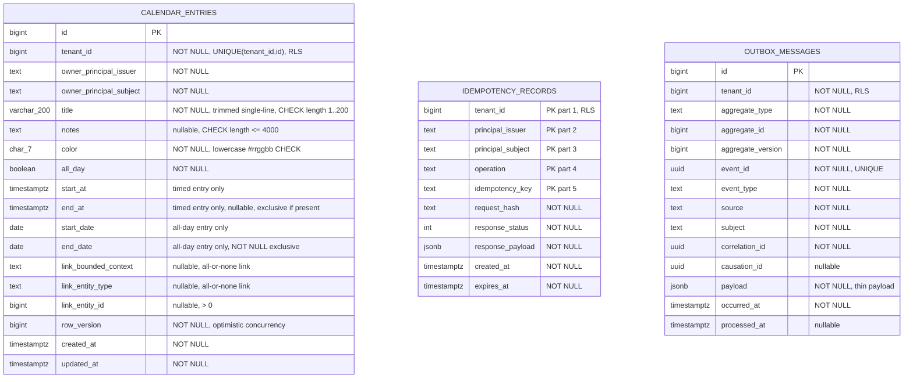

# Collaboration schema (`collaboration`)

Physical schema for the Collaboration module's first system-of-record aggregate:
personal calendar entries. This document is authoritative for the EF Core model and
must be checked line by line before generating its first migration.

## Ownership and boundaries

`collaboration` owns calendar-entry data only. A `CalendarEntry` is a user-created
note with its own time semantics; it is not a projection and never becomes authority
for dates owned by CRM or another module. It may carry an `EntityRef`-shaped link to
an external record, but has no cross-schema foreign key and never stores that
record's display name.

Every table below is tenant-scoped, has `tenant_id`, and must have PostgreSQL RLS
enabled and forced. Runtime access uses transaction-local `app.tenant_id`; policy
`tenant_isolation` is `USING (tenant_id = NULLIF(current_setting('app.tenant_id', true), '')::bigint)`
with the same expression in `WITH CHECK`; `NULLIF` makes an absent tenant setting
fail closed rather than raising a cast error.

## Tables

### `calendar_entries`

`id` is an identity `bigint` primary key and `(tenant_id, id)` is an alternate key.
`owner_principal_issuer` and `owner_principal_subject` are the immutable `PrincipalRef`
of the owner; no foreign key crosses into Identity/Access.

`title` is a trimmed, single-line 1--200-character plain-text value. It has
`CHECK (title = btrim(title) AND char_length(title) BETWEEN 1 AND 200 AND
position(E'\\n' IN title) = 0 AND position(E'\\r' IN title) = 0)`. `notes` is nullable,
plain text, and at most 4,000 characters. Neither may be logged or placed in an
outbox payload. `color` is normalized to lowercase by the domain and has
`CHECK (color ~ '^#[0-9a-f]{6}$')`.

Timed entries use `start_at timestamptz` and nullable `end_at timestamptz`. The API
accepts and returns offset-bearing ISO 8601 and PostgreSQL stores the instant in UTC.
An offset-less timed value is rejected as a `400 validation_error`; API tests cover
both `startAt` and `endAt` so server-local timezone cannot enter the contract.
All-day entries use timezone-free `start_date date` and nullable `end_date date`.
An end is exclusive in both forms, matching FullCalendar. The API range is timed;
the list query derives dates from the range and widens each side by one day before
its all-day overlap predicate.

Constraints:

- `all_day` requires `start_date IS NOT NULL`, `end_date IS NOT NULL`, `start_at IS NULL`, and `end_at IS NULL`.
- `NOT all_day` requires `start_at IS NOT NULL`, `start_date IS NULL`, and `end_date IS NULL`.
- `end_at IS NULL OR end_at > start_at`.
- `end_date IS NULL OR end_date > start_date`.
- `link_bounded_context`, `link_entity_type`, and `link_entity_id` are either all
  null or all non-null; `link_entity_id > 0` when present.
- `link_bounded_context` and `link_entity_type` match the lower-case identifier
  grammar `^[a-z][a-z0-9_]*$` whenever present.

The link is `EntityRef`-shaped: its tenant is this row's `tenant_id`; the bounded
context, entity type, and id are stored without an FK because the target is owned by
another module. Target labels are resolved at read time under current authorization.

Indexes:

- `(tenant_id, owner_principal_issuer, owner_principal_subject, start_at)` for timed
  range reads;
- `(tenant_id, owner_principal_issuer, owner_principal_subject, start_date)` for
  all-day range reads;
- `(tenant_id, owner_principal_issuer, owner_principal_subject, id)` supports
  owner-scoped get/update/delete;
- `(tenant_id, aggregate_type, aggregate_id)` on outbox_messages for dispatcher scans.

`row_version bigint NOT NULL` is the aggregate concurrency token. It has no database
default: the domain always sets it (1 on create) and advances it before persistence,
so the previous value participates in EF Core's update predicate.

### `idempotency_records`

Module-local duplicate of the platform pattern. Its natural key is
`(tenant_id, principal_issuer, principal_subject, operation, idempotency_key)`;
the request hash rejects reuse with a changed normalized request. Responses have a
bounded retention period. Create, update, and delete write this row in the same
transaction as their state/outbox effect. An `expires_at` index supports bounded-
retention cleanup without a full table scan.

### `outbox_messages`

Module-local CloudEvents-shaped durable intent. The unique `event_id`, source,
subject, correlation/causation IDs and aggregate version use the established module
outbox shape. Payloads are deliberately thin: entry id, owner principal, timing and
link ref only; never title, notes, or a hydrated target label. `processed_at IS NULL`
has a partial index. v1 has no Worker dispatcher.

Event types (all `enterprise.collaboration.calendar-entry.<verb>.v1`, subject
`calendar-entries/{id}`, source `/enterprise/collaboration`):

- `created` and `updated` carry the payload above; `aggregate_version` is the entry's
  `row_version` after the change.
- `deleted` carries only entry id, owner principal and `version`; there is no
  timing or link ref because the entry no longer exists. `aggregate_version` and
  `version` are the version the deletion took (the superseded `row_version` + 1).

## RLS and runtime grants

The generated initial migration creates the model. A generated otherwise-empty RLS
migration may contain hand-written `migrationBuilder.Sql` only to `ENABLE` and
`FORCE ROW LEVEL SECURITY` plus create/reverse `tenant_isolation` for all three
tables. `scripts/create-runtime-role.sql` must grant schema usage, table DML,
sequence usage/select, and matching default privileges to `fynovio_app`.

RLS tests run with `PostgresFixture.RuntimeConnectionStringAsync()`, not the
migration owner. They prove both cross-tenant invisibility and `WITH CHECK`
cross-tenant write rejection for entries, idempotency rows, and outbox rows.

## Deliberate exclusions

There is no soft-delete column, evidence table, recurrence, attendee, reminder,
external-sync or sharing table. Evidence is not required for these non-risk-catalogued
personal-note commands under the current enforcement scope. Hard delete emits a thin
outbox fact in the same transaction.
