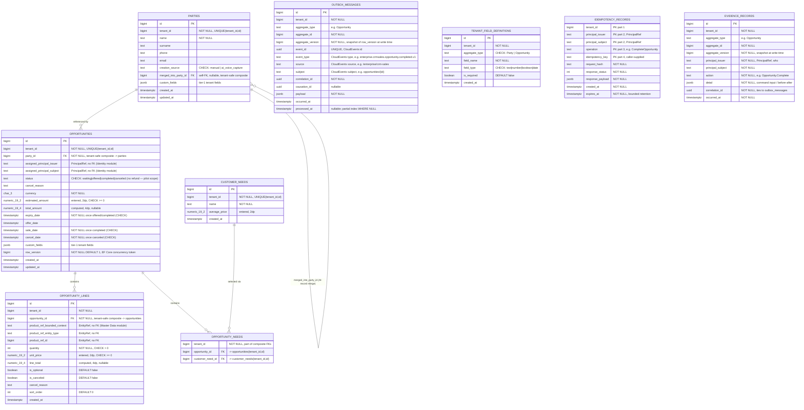

# CRM+Sales pilot schema (PostgreSQL, `crm` schema)

Physical schema for the merged CRM+Sales pilot aggregate decided in
`docs/architecture-analysis/17_CRM_SALES_PILOT_DOMAIN.md` (in the research
project, sibling to this repo). Revision 4 (2026-09-16) — Revision 3's design is
implemented in `src/Modules/CRM/`; the implementation-side corrections are recorded
in "Revision 4" at the end of this file.

## Diagram

## What changed in this revision, and why

An external review (2026-09-14) checked this schema before any EF Core code was written. Each accepted point below is a technical correction against this file's own already-stated conventions ([17](../../../enterprise%20ve%20B2B%20mimari%20araştırma/docs/architecture-analysis/17_CRM_SALES_PILOT_DOMAIN.md) §3), not a new decision:

1. **Tenant-safe composite foreign keys.** `tenant_id NOT NULL` plus RLS controls row *visibility*, but does not stop a row from being written with a `party_id`/`opportunity_id` that actually belongs to a different tenant — RLS is not a referential-integrity guarantee. Every table gets `UNIQUE (tenant_id, id)` in addition to its `id` primary key, and every FK is composite: `FOREIGN KEY (tenant_id, party_id) REFERENCES parties (tenant_id, id)`. This directly fulfills [17](.) §3.1's "part of composite keys/indexes" — the first draft stated that rule but didn't fully apply it.
2. **`opportunity_needs` restored.** The first draft included `customer_needs` but connected it to nothing — an orphaned table. Legacy's `sales_opportunity_needs` join (opportunity ↔ need) is real and used to compute `estimated_amount` at creation (discovery report: "tahmini tutar seçili ihtiyaçların average_price toplamı"). Restored as a proper composite-FK join table rather than left dangling or silently dropped.
3. **Refund removed from the pilot's active domain entirely — not merely relabeled.** The first draft mixed lifecycle state (`waiting/offered/completed/canceled`) with transaction type (`refund/partial_refund`) in one `status` column. Rather than just splitting them into a separate `type` column, the platform owner confirmed (2026-09-14) refund handling isn't part of the pilot's active domain at all — [18 Legacy Migration Strategy](.) §1 already treats historical refund rows as archive-only (staying in `crm-app`, never imported), so a `type` column that would always read `'sale'` for every pilot-created row is dead weight, not future-proofing. `status` is now exactly the four lifecycle states; no `type` column, no refund-lineage self-FK. When refund becomes a real capability, it gets designed and migrated properly at that time — not carried as an unused column now.
4. **`row_version` mechanism specified.** An explicit `bigint NOT NULL DEFAULT 1` column, not Postgres's internal `xmin` — chosen specifically because it maps directly onto the `EntityVersion` primitive already added to `Contracts` (also a `long`), keeping one consistent version representation across the codebase rather than two (an internal system column for storage, a `Contracts` type for the API surface). An EF Core `SaveChanges` interceptor increments it on every update and uses the previous value as the concurrency token in the `WHERE` clause. *(Superseded by Revision 4, item 13: the aggregate increments it.)*
5. **Outbox envelope completed to match doc 04's own CloudEvents shape.** `source`, `subject`, `correlation_id`, `causation_id`, `aggregate_version` added — these are exactly [04 Canonical Concepts](.) §4's event wire profile fields, which the first draft's outbox table didn't carry. Needed to answer "which CRM operation produced this fact" once a real event chain exists (Inventory/Finance/Evidence consumers). `UNIQUE(event_id)` and a partial index on `processed_at IS NULL` added — standard outbox-pattern hygiene.
6. **`average_price_minor` renamed to `average_price`.** "Minor unit" in currency terminology means an integer smallest-subdivision representation (e.g., `1999` meaning `19.99`); this column is a `numeric(19,2)` decimal, so the original name was a real misnomer, not a style preference.
7. **`original_party_id` renamed to `merged_into_party_id`.** The original name didn't convey direction — does it point from the real record to a copy, or the reverse? The actual semantics ([17](.) §5): an AI-derived draft record gets merged *into* a canonical one. `merged_into_party_id` on the AI-derived row states that unambiguously.
8. **Constraint/index set filled in before migration, not after.** `CHECK (quantity > 0)`, `CHECK (unit_price >= 0)`, `CHECK (estimated_amount >= 0)`, explicit `DEFAULT false` on the two boolean flags, and lookup indexes (`opportunities(tenant_id, status)`, `(tenant_id, party_id)`, `(tenant_id, assigned_principal_subject)`, `(tenant_id, created_at)`, `opportunity_lines(tenant_id, opportunity_id)`). Extended the same rigor already applied to `expiry_date` ([17](.) §2's enforced-gate decision) to two more state-consistency invariants: `CHECK (status <> 'completed' OR sale_date IS NOT NULL)` and `CHECK (status <> 'canceled' OR (cancel_date IS NOT NULL AND cancel_reason IS NOT NULL))`.

**Reviewed and explicitly deferred, not applied:** a `party_type: person | organization` distinction on `Party`. Legacy's own `customers` table is person-shaped only (name/surname/phone/email, no organization-name field), and nothing in the pilot's confirmed scope requires representing a dealer's own customer as a company. Adding it now would be speculative — revisit if a concrete pilot customer needs to capture a business buyer, not before.

## Revision 3 (2026-09-14): command idempotency and evidence atomicity

A second external review re-checked Revision 2 and found two structural gaps that were real (unlike five other points it raised, which were already resolved above — see the correction note at the end of this section). Both are closed here, before any EF Core code, per [17](.) §6's rule that structural commitments belong in the design, not a later migration.

9. **`idempotency_records` added.** `outbox_messages.event_id` deduplicates *outbound* events only — nothing stopped a retried inbound command (e.g. `CompleteOpportunity` resent after a client-side timeout) from being processed twice, which is a double-processing path on a money-carrying transition. This directly implements [04 Canonical Concepts](.)'s `IdempotencyKey` primitive (tenant + caller + operation + key, bounded retention). Keyed on `(tenant_id, principal_issuer, principal_subject, operation, idempotency_key)` — no surrogate id, since the natural key is the lookup. `request_hash` catches a caller reusing the same key with a different payload (misuse, not a legitimate retry). `response_payload` is written in the same transaction as the domain change, so a retry after the original committed just replays the cached response instead of re-executing the command. Placed in the `crm` schema for now, matching every other module-owned table here; if a second module needs the same mechanism it becomes a shared platform primitive at that point — the same extraction-trigger discipline already applied to `Party` above, run in the direction of generalizing a proven local pattern rather than building a shared one speculatively.
10. **`evidence_records` added.** [14 Architecture Decisions](.) decision #4 is "state + outbox + evidence commit together" — three things, not two. Revision 2's outbox table satisfied the integration-event half of that but had no answer for the audit/compliance half, and [17](.) §6 item 3 is explicit that evidence recording ships with the pilot rather than being deferred because legacy never had it. `evidence_records` is an append-only table (no `updated_at`, no delete path) capturing who (`PrincipalRef`), what action, what changed (`detail` jsonb — command input and/or before/after values), and which aggregate/version it applies to, written in the same `SaveChanges()` transaction as the domain state and outbox rows. It does not itself constitute the future Evidence module — a later module reads or projects from this table (or migrates it) once that module exists; what's guaranteed now is that the *intent to produce evidence* is never lost to a transaction that commits state without it.

**Correction to the review that prompted this revision:** it raised 7 points; 5 were checked against this file and found already resolved in Revision 2 — tenant-safe composite FKs (§1 above), outbox `correlation_id`/`causation_id`/`aggregate_version` (§5), the `row_version` increment mechanism (§4), `CUSTOMER_NEEDS`'s relationship via `opportunity_needs` (§2), and refund's removal from `status` (§3, done more completely than the review's suggestion of a separate `type` column). Its evidence-related claim — that this file already specifies a later-subscribes-from-outbox model for evidence — is not something this file said anywhere; that claim did not survive verification, and the actual gap it was gesturing at (evidence atomicity) is closed by item 10 above instead.

**Domain-vs-database invariant boundary, made explicit:** the rule "an `Opportunity` cannot become `completed` without at least one active required `OpportunityLine`" spans rows across `opportunity_lines`, so it cannot be a single-table Postgres `CHECK`. It is enforced in the `Opportunity` aggregate's `Complete()` method, not the database — the database enforces structural integrity (types, FKs, single-row state consistency), the aggregate enforces cross-row business invariants, and workflow/policy concerns (the still-open approval-step decision) would be a third, separate layer above both. Recorded here so the boundary is a stated decision, not an implicit gap a future reviewer has to rediscover.

## Open architectural note: `Party` lives in the CRM schema as a pilot exception

[08 Module Boundaries](.) assigns Party identity to **Master Data**, not CRM (`CreateParty/Product, LinkSourceIdentity, Propose/ApproveMerge, GetMaster`) — this schema's first draft put `parties` directly in the `crm` schema without checking that. **Platform owner decision (2026-09-14):** keep `Party` in the CRM schema for the pilot, as a deliberate, named exception — the same shape as the already-decided CRM+Sales merge ([17](.) §1, using [08](.) §2's own pilot-assembly allowance, itself echoing [08](.) §2's note that "Master Data starts with Party... only if the slice requires it"). **Extraction trigger** (per [08](.) §6's "measure the trigger first" discipline): move `Party` into a real Master Data module/schema when a second module besides CRM needs to create or resolve Party records — at that point CRM's `opportunities.party_id` composite FK becomes an `EntityRef`-shaped cross-module reference instead, matching how `opportunity_lines` already references the (not-yet-built) product catalog.

## Design notes carried over from revision 1 (still accurate)

### Tenant isolation ([17](.) §3.1)
`ENABLE ROW LEVEL SECURITY` + `FORCE ROW LEVEL SECURITY` on every table, policy comparing `tenant_id` to a session-scoped setting, tested against the **unprivileged runtime role** per FF03 — superusers and table owners bypass RLS regardless of policy.

### Cross-module references carry no FK ([07](.) §3, `EntityRef` in `Contracts`)
`opportunity_lines.product_ref_*` stays `EntityRef`-shaped with no FK — Master Data doesn't own real product rows yet, and doc 07 forbids cross-schema FKs. Same treatment for `assigned_principal_*` referencing Identity/Access.

### Money: one rounding rule ([17](.) §3.4)
Entered values (`estimated_amount`, `unit_price`, `customer_needs.average_price`) are `numeric(19,2)`. Computed values (`total_amount`, `line_total`) are `numeric(19,4)`. The one declared rounding point: a computed total is rounded from 4dp to the currency's 2dp minor unit exactly once, at the moment an opportunity transitions to `completed`.

### No soft delete ([17](.) §3.5)
No `deleted_at` anywhere. Cancellation is `status = 'canceled'` + `cancel_reason` (now DB-enforced together), not a second, unowned deletion concept.

### Atomic durable intent ([14](.) decision #4)
`outbox_messages` lives in this same `crm` schema, written by the same `SaveChanges()` call as the aggregate change it describes — one transaction.

### Tier-1 tenant custom fields ([15](.) §7)
`custom_fields jsonb` governed by `tenant_field_definitions`, unique on `(tenant_id, aggregate_type, field_name)` — not a generic EAV table set.

## Contracts primitives already added (`src/Contracts/`)

`TenantId`, `PrincipalRef`, `EntityRef`, `EntityVersion` (revision 1), plus the `IHasRowVersion` marker (moved from `CRM.Persistence` when the Access module needed it).

## Revision 4 (2026-09-16): implementation-side corrections

Implemented against the binding core recorded in `AGENTS.md` ("Enforcement Scope") and research doc 20. Migrations, in order: `InitialCrmSchema`, `FixOpportunityAssignedPrincipalIndex`, `FixCancelExpiryCheck`, `EnableRowLevelSecurity`.

11. **`ck_opportunities_expiry_required_once_offered` fixed.** The original expression `status = 'waiting' OR expiry_date IS NOT NULL` also covered `canceled`, so an opportunity that was never offered could not be canceled. New expression: `status NOT IN ('offered','completed') OR expiry_date IS NOT NULL` (migration `FixCancelExpiryCheck`). A test for it now exists, per the binding rule that every CHECK constraint has one.
12. **Line cancellation goes through the aggregate root.** `OpportunityLine.Cancel` is `internal`; callers use `Opportunity.CancelLine(line, reason)`, which bumps the root's `row_version`. Previously a line could be canceled without touching the root, so a concurrent `Complete()` could pass the "at least one active required line" check against stale lines and both transactions would commit.
13. **`row_version` is incremented by the aggregate, not an interceptor.** This supersedes item 4's "an EF Core `SaveChanges` interceptor increments it". `CRM.Persistence.RowVersionInterceptor` is deleted; every mutating `Opportunity` method increments the version itself, after its guards pass. The interceptor ran during `SaveChanges`, so an outbox or evidence row built in the same transaction recorded the previous version. EF Core's concurrency check is unchanged: the loaded value is still the `WHERE` value.
14. **The money rule is implemented.** `opportunity_lines.line_total` is computed when a line is added. `Opportunity.Complete()` no longer takes a total: it derives it from active, non-optional lines (optional lines are unselected alternatives — platform owner decision, 2026-09-16) and rounds to 2dp at that single point. Entered values (`unit_price`, `estimated_amount`) with more than two decimals are rejected in the domain, because PostgreSQL would otherwise round them silently into `numeric(19,2)`. With integer quantities and 2dp prices no computed value exceeds 2dp yet; the 4dp column and rounding point are there for discounts.
15. **RLS is implemented** (migration `EnableRowLevelSecurity`, the one hand-written migration body `AGENTS.md` permits). All nine tables above are `ENABLE` + `FORCE ROW LEVEL SECURITY` with a `tenant_isolation` policy on `tenant_id = NULLIF(current_setting('app.tenant_id', true), '')::bigint` for both `USING` and `WITH CHECK`. `NULLIF` is required: after a transaction-local setting ends, `current_setting` returns `''` rather than `NULL` on that pooled connection, and `''::bigint` fails. The application sets the value per transaction with `CrmDbContextTenantExtensions.SetTenantContextAsync`, which refuses to run outside an explicit transaction. The runtime role is created by `scripts/create-runtime-role.sql`, which also revokes `UPDATE`/`DELETE` on `evidence_records` (append-only at the privilege level, not just by convention).
16. **First command.** `CRM.Application.CompleteOpportunityHandler` writes the state change, outbox row, evidence row and idempotency record in one `SaveChanges()` inside one transaction, with the tenant context set on that transaction. Outbox: `enterprise.crmsales.opportunity.completed.v1`, source `/enterprise/crm-sales`, subject `opportunities/{id}`. A retry with the same key replays the stored response; the same key with a different request throws `IdempotencyKeyReusedException`; another tenant's opportunity is reported as `OpportunityNotFoundException`.

**Still open on this schema:**
- `row_version` has no database-level `DEFAULT 1` (the diagram above says it should). EF always writes the value, but raw SQL inserts (seeds, legacy import) would fail.
- Expired idempotency records are still replayed, and nothing purges them yet.
- Two concurrent first attempts with the same key: the loser gets a unique-violation `DbUpdateException`, not the replayed response, so the caller has to retry.
- `estimated_amount` is still supplied by the caller instead of being summed from the selected `customer_needs` (revision 2, item 2).
