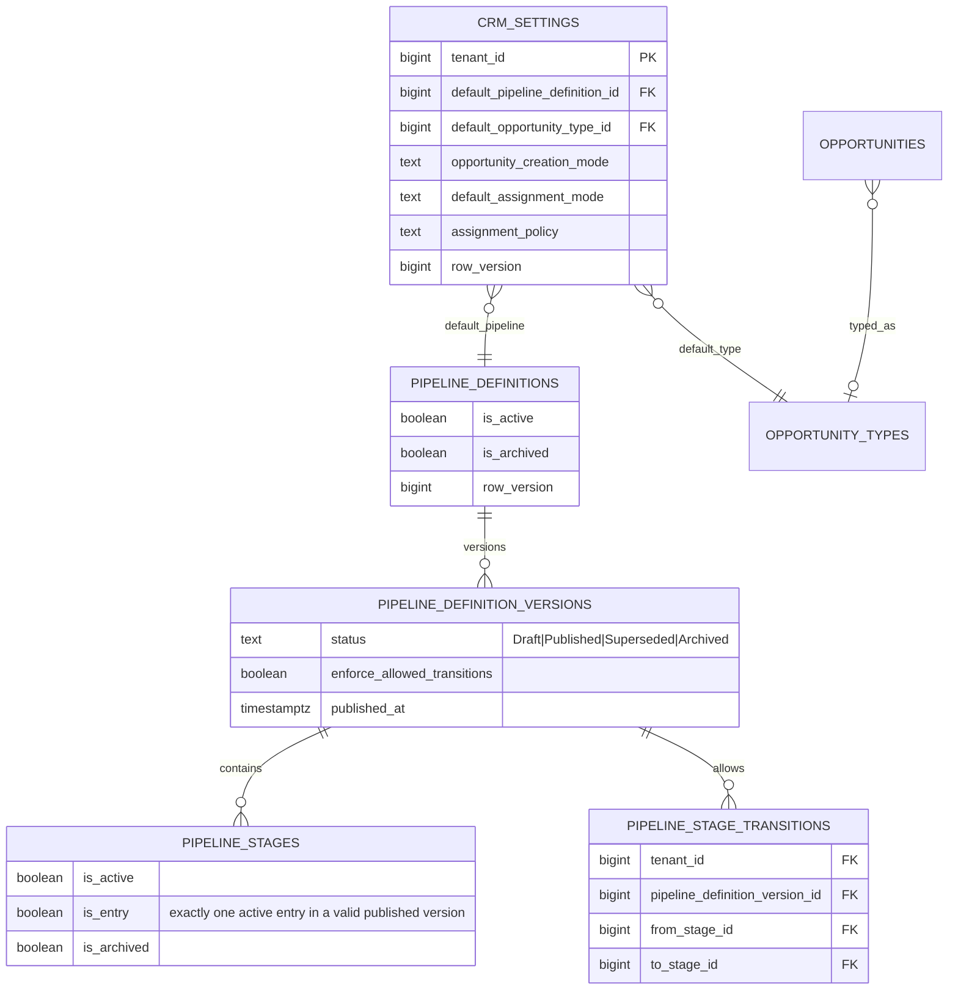

# CRM+Sales pilot schema (PostgreSQL, `crm` schema)

## Revision 13 (2026-10-01): opportunity activity projection and inbox

Two tables, both written only by the `crm.opportunity-activity` event consumer (`docs/plans/ai-business-os/adr-event-consumption.md`, E-2 (a)), never by a command:
- **`crm.opportunity_activity`** — one row per published `enterprise.crmsales.opportunity.*.v1` fact: `opportunity_id`, `event_id` (unique per tenant), `kind`, `aggregate_version`, `occurred_at`, and the producer's `payload` (jsonb, kept so the read side labels stages, owners and fields at read time). Index `(tenant_id, opportunity_id, occurred_at)`. **No foreign key** to `opportunities`: a projection is rebuilt from the outbox and never constrains its source.
- **`crm.consumed_events`** — CRM's inbox, primary key `(consumer, event_id)`, written in the same transaction as the projection row; a redelivery hits the key and is a no-op.
- Both have `ENABLE` + `FORCE ROW LEVEL SECURITY` with the standard `tenant_isolation` policy (migration `AddOpportunityActivityProjection`, hand-written RLS body).
- Read through `GET /opportunities/{id}/activity`, authorized exactly like the opportunity detail (same action key and resource descriptor; denial is 404).
- `crm.outbox_messages` additionally carries the Messaging migration's `relay_access` policy (pointer columns only, for `fynovio_relay`); see `docs/schema/messaging-schema.md`.
- Line add/cancel write evidence but no outbox row, so they are not facts and do not appear on the timeline.

## Revision 12 (2026-10-01): custom field list filter index

`crm.opportunities` has a GIN index `ix_opportunities_custom_fields` on `custom_fields` with `jsonb_path_ops`.
- **What it serves:** the Opportunity list's custom field filters.
  - Filters are equality only, on select, multi_select and boolean fields.
  - The handler validates them against the field definitions it reads from the Semantic Catalog (`semantic.field_definitions`, via `ISemanticDefinitionReader`), then applies them as one jsonb containment predicate (`custom_fields @> '{...}'`).
  - They are ANDed with the caller's access scope and the RLS tenant predicate.
- **No change** to the columns, CHECK constraints or RLS.

## Revision 11 (2026-09-30): Tier-1 tenant custom field schema expansion

**Moved (phase 2, 2026-10-01): `crm.tenant_field_definitions` no longer exists** — its Opportunity rows were copied (ids preserved) into `semantic.field_definitions` and the table was dropped; see `semantic-catalog-schema.md`. What follows is the historical tier-1 shape. `crm.tenant_field_definitions` had expanded with new columns and CHECK constraints. New columns: `label` (varchar 100, required, user-facing field name), `config` (jsonb, default '{}', validates as object), `status` (varchar 16, default 'Active', lifecycle: Active|Deprecated), `sort_order` (integer, default 0, range 0–10000), `owner_scope` (varchar 16, fixed to 'Tenant'), `row_version` (bigint, default 1, concurrency token), `updated_at` (timestamp with time zone, default now()). Existing `field_name` column changed from text to varchar(63). New CHECK constraints validate aggregate_type ('Party'|'Opportunity'), field_type (11 types: text, long_text, number, decimal, boolean, date, select, multi_select, email, phone, url), field_name (regex: lowercase start, 2–63 chars), status, owner_scope, sort_order range, and config as valid JSON object. Unique constraint on (tenant_id, aggregate_type, field_name) was already present. RLS (ENABLE+FORCE + tenant policy) already in place from Phase 1. See `docs/plans/ai-business-os/adr-tier1-custom-fields.md`.

## Revision 10 (2026-09-24): Opportunity archive lifecycle

`crm.opportunities` has `is_archived` and nullable `archived_at`, with CHECK constraints requiring these fields to agree and forbidding archived Won/Lost records. Archiving does not alter the lifecycle status or pipeline stage. Normal opportunity list queries select only non-archived rows; the archive view selects archived rows. Archive and restore are tenant-scoped, authorized, optimistic-concurrency-protected, idempotent commands, with audit evidence and outbox facts committed atomically. Restore preserves the original lifecycle and stage, except that an Open opportunity whose referenced stage is inactive must be restored to an active stage in the same pipeline version. No hard-delete command is exposed.

Physical schema for the CRM module decided in
`docs/architecture-analysis/17_CRM_SALES_PILOT_DOMAIN.md` (in the research
project, sibling to this repo). Revision 5 (2026-09-16) — Phase 1's Lifecycle and
Pipeline foundation; Revisions 1-4's design already implemented; Phase 1 changes
recorded in "Revision 5" at the end of this file.

## Revision 9 (2026-09-24): CRM configuration management

Tenant-owned CRM defaults use typed columns in `crm.crm_settings` (one row per tenant, optimistic `row_version`): default pipeline, creation mode, ordered JSONB opportunity creation steps, default opportunity type, close requirements and assignment policy/default references. The creation steps are unique values from `Customer`, `Needs`, and `Products`; `Customer` is mandatory, and JSONB checks enforce the allowed values and step count. Pipeline and type defaults use tenant-safe composite foreign keys. `crm.opportunity_types` and `crm.lost_reasons` are tenant catalogs with stable keys and `Active`/`Inactive`/`Archived` lifecycle. `customer_needs` gains nullable `category` and a status lifecycle; existing rows are backfilled as `Active`. The new tenant tables have ENABLE+FORCE RLS and the standard `tenant_isolation` policy.

`crm.pipeline_definitions` now carries active/archive lifecycle and a concurrency version. `pipeline_definition_versions` uses `Draft`/`Published`/`Superseded`/`Archived` with a CHECK constraint; new versions default to `Draft` at the database boundary, while previously published rows retain their state. Stage changes are authored in a draft and published as a new immutable version. Stages have explicit entry, active/archive lifecycle and stable per-version order. `pipeline_stage_transitions` stores version-scoped allowed edges with composite tenant/version/stage FKs. Opportunity references keep pointing at their original version and stage; the opportunity stage FK now proves it belongs to the referenced version. Publishing reports the count retained on previous versions and never remaps those records. No hard-delete path exists for referenced configuration.

`opportunities.opportunity_type_id` is nullable for backward compatibility and has a tenant-safe FK to `opportunity_types`. Creation applies the tenant default type and assignment configuration. Opportunity type, lost reason and customer-need status enums, together with the closed setting enums, are constrained to their explicit string vocabularies with CHECK constraints. Lost reasons remain text snapshots on closed opportunities, while the tenant catalog is lifecycle-managed. CRM settings/pipeline/catalog writes use CRM PDP actions and commit state, idempotency, evidence and outbox transactionally. The settings APIs do not own platform Custom Fields, Workflow, Automation, Notifications or Authorization.

## Diagram additions

## Diagram

```mermaid
erDiagram
    OPPORTUNITIES ||--o{ OPPORTUNITY_LINES : contains
    OPPORTUNITIES ||--o{ OPPORTUNITY_NEEDS : contains
    CUSTOMER_NEEDS ||--o{ OPPORTUNITY_NEEDS : "selected via"
    PIPELINE_DEFINITION_VERSIONS ||--o{ PIPELINE_STAGES : contains
    PIPELINE_DEFINITIONS ||--o{ PIPELINE_DEFINITION_VERSIONS : versions

    PIPELINE_DEFINITIONS {
        bigint id PK
        bigint tenant_id "NOT NULL, UNIQUE(tenant_id,id)"
        text name "NOT NULL, UNIQUE(tenant_id,name)"
        timestamptz created_at
        timestamptz updated_at
    }

    PIPELINE_DEFINITION_VERSIONS {
        bigint id PK
        bigint tenant_id "NOT NULL"
        bigint pipeline_definition_id FK "NOT NULL, tenant-safe composite"
        int version_number "NOT NULL, UNIQUE(tenant_id,pipeline_definition_id,version_number)"
        timestamptz created_at
    }

    PIPELINE_STAGES {
        bigint id PK
        bigint tenant_id "NOT NULL"
        bigint pipeline_definition_version_id FK "NOT NULL, tenant-safe composite"
        text name "NOT NULL, UNIQUE(tenant_id,pipeline_definition_version_id,name)"
        int sort_order "NOT NULL, UNIQUE(tenant_id,pipeline_definition_version_id,sort_order)"
        timestamptz created_at
    }

    CUSTOMER_NEEDS {
        bigint id PK
        bigint tenant_id "NOT NULL, UNIQUE(tenant_id,id)"
        text name "NOT NULL"
        numeric_19_2 average_price "entered, 2dp"
        timestamptz created_at
    }

    OPPORTUNITY_NEEDS {
        bigint tenant_id "NOT NULL, part of composite FKs"
        bigint opportunity_id FK "-> opportunities(tenant_id,id)"
        bigint customer_need_id FK "-> customer_needs(tenant_id,id)"
    }

    OPPORTUNITIES {
        bigint id PK
        bigint tenant_id "NOT NULL, UNIQUE(tenant_id,id)"
        bigint party_ref_party_id "PartyRef's PartyId half, CHECK > 0, no FK (Party in MasterData) — TenantId half is this row's own tenant_id, not a stored column"
        text assigned_principal_issuer "PrincipalRef, no FK (Identity module)"
        text assigned_principal_subject "PrincipalRef, no FK (Identity module)"
        text status "CHECK: draft|open|won|lost (Phase 1 lifecycle foundation)"
        text lost_reason "nullable, replaces cancel_reason"
        char_3 currency "NOT NULL"
        numeric_19_2 estimated_amount "entered, 2dp, CHECK >= 0"
        numeric_19_4 total_amount "computed, 4dp, nullable"
        timestamptz expiry_date "NOT NULL once open/won (CHECK, unchanged from Revision 4 aside from the rename)"
        timestamptz opened_date "nullable (replaces offer_date)"
        timestamptz won_date "nullable (replaces sale_date)"
        timestamptz lost_date "nullable (replaces cancel_date)"
        bigint pipeline_definition_version_id "nullable, unenforced (Phase 1)"
        bigint pipeline_stage_id "nullable, unenforced (Phase 1)"
        jsonb custom_fields "tier-1 tenant fields"
        bigint row_version "NOT NULL DEFAULT 1, EF Core concurrency token"
        timestamptz created_at
        timestamptz updated_at
    }

    OPPORTUNITY_LINES {
        bigint id PK
        bigint tenant_id "NOT NULL"
        bigint opportunity_id FK "NOT NULL, tenant-safe composite -> opportunities"
        text product_ref_bounded_context "EntityRef, no FK (Master Data module)"
        text product_ref_entity_type "EntityRef, no FK"
        bigint product_ref_id "EntityRef, no FK"
        int quantity "NOT NULL, CHECK > 0"
        numeric_19_2 unit_price "entered, 2dp, CHECK >= 0"
        numeric_19_4 line_total "computed, 4dp, nullable"
        boolean is_optional "DEFAULT false"
        boolean is_canceled "DEFAULT false"
        text cancel_reason
        int sort_order "DEFAULT 0"
        timestamptz created_at
    }

    OUTBOX_MESSAGES {
        bigint id PK
        bigint tenant_id "NOT NULL"
        text aggregate_type "e.g. Opportunity"
        bigint aggregate_id "NOT NULL"
        bigint aggregate_version "NOT NULL, snapshot of row_version at write time"
        uuid event_id "UNIQUE, CloudEvents id"
        text event_type "CloudEvents type, e.g. enterprise.crmsales.opportunity.completed.v1"
        text source "CloudEvents source, e.g. /enterprise/crm-sales"
        text subject "CloudEvents subject, e.g. opportunities/{id}"
        uuid correlation_id "NOT NULL"
        uuid causation_id "nullable"
        jsonb payload "NOT NULL"
        timestamptz occurred_at
        timestamptz processed_at "nullable; partial index WHERE NULL"
    }

    TENANT_FIELD_DEFINITIONS {
        bigint id PK
        bigint tenant_id "NOT NULL"
        varchar_32 aggregate_type "NOT NULL, CHECK: Party|Opportunity"
        varchar_63 field_name "NOT NULL, UNIQUE(tenant_id,aggregate_type,field_name), CHECK: regex ^[a-z][a-z0-9_]{1,62}$"
        varchar_16 field_type "NOT NULL, CHECK: text|long_text|number|decimal|boolean|date|select|multi_select|email|phone|url"
        boolean is_required "DEFAULT false"
        varchar_100 label "NOT NULL, DEFAULT ''"
        jsonb config "NOT NULL, DEFAULT '{}', CHECK: jsonb_typeof(config)='object'"
        varchar_16 status "NOT NULL, DEFAULT 'Active', CHECK: Active|Deprecated"
        integer sort_order "NOT NULL, DEFAULT 0, CHECK: BETWEEN 0 AND 10000"
        varchar_16 owner_scope "NOT NULL, DEFAULT 'Tenant', CHECK: ='Tenant'"
        bigint row_version "NOT NULL DEFAULT 1, EF Core concurrency token"
        timestamptz created_at
        timestamptz updated_at "NOT NULL, DEFAULT now()"
    }

    IDEMPOTENCY_RECORDS {
        bigint tenant_id "PK part 1"
        text principal_issuer "PK part 2, PrincipalRef"
        text principal_subject "PK part 2, PrincipalRef"
        text operation "PK part 3, e.g. CompleteOpportunity"
        text idempotency_key "PK part 4, caller-supplied"
        text request_hash "NOT NULL"
        int response_status "NOT NULL"
        jsonb response_payload "NOT NULL"
        timestamptz created_at "NOT NULL"
        timestamptz expires_at "NOT NULL, bounded retention"
    }

    EVIDENCE_RECORDS {
        bigint id PK
        bigint tenant_id "NOT NULL"
        text aggregate_type "e.g. Opportunity"
        bigint aggregate_id "NOT NULL"
        bigint aggregate_version "NOT NULL, snapshot at write time"
        text principal_issuer "NOT NULL, PrincipalRef, who"
        text principal_subject "NOT NULL"
        text action "NOT NULL, e.g. Opportunity.Complete"
        jsonb detail "NOT NULL, command input / before-after"
        uuid correlation_id "NOT NULL, ties to outbox_messages"
        timestamptz occurred_at "NOT NULL"
    }
```

## What changed in this revision, and why

An external review (2026-09-14) checked this schema before any EF Core code was written. Each accepted point below is a technical correction against this file's own already-stated conventions ([17](../../../enterprise%20ve%20B2B%20mimari%20araştırma/docs/architecture-analysis/17_CRM_SALES_PILOT_DOMAIN.md) §3), not a new decision:

1. **Tenant-safe composite foreign keys.** `tenant_id NOT NULL` plus RLS controls row *visibility*, but does not stop a row from being written with a `party_id`/`opportunity_id` that actually belongs to a different tenant — RLS is not a referential-integrity guarantee. Every table gets `UNIQUE (tenant_id, id)` in addition to its `id` primary key, and every FK is composite: `FOREIGN KEY (tenant_id, party_id) REFERENCES parties (tenant_id, id)`. This directly fulfills [17](.) §3.1's "part of composite keys/indexes" — the first draft stated that rule but didn't fully apply it.
2. **`opportunity_needs` restored.** The first draft included `customer_needs` but connected it to nothing — an orphaned table. Legacy's `sales_opportunity_needs` join (opportunity ↔ need) is real and used to compute `estimated_amount` at creation (discovery report: "tahmini tutar seçili ihtiyaçların average_price toplamı"). Restored as a proper composite-FK join table rather than left dangling or silently dropped.
3. **Refund removed from the pilot's active domain entirely — not merely relabeled.** The first draft mixed lifecycle state (`waiting/offered/completed/canceled`) with transaction type (`refund/partial_refund`) in one `status` column. Rather than just splitting them into a separate `type` column, the platform owner confirmed (2026-09-14) refund handling isn't part of the pilot's active domain at all — [18 Legacy Migration Strategy](.) §1 already treats historical refund rows as archive-only (staying in `crm-app`, never imported), so a `type` column that would always read `'sale'` for every pilot-created row is dead weight, not future-proofing. `status` is now exactly the four lifecycle states; no `type` column, no refund-lineage self-FK. When refund becomes a real capability, it gets designed and migrated properly at that time — not carried as an unused column now.
4. **`row_version` mechanism specified.** An explicit `bigint NOT NULL DEFAULT 1` column, not Postgres's internal `xmin` — chosen specifically because it maps directly onto the `EntityVersion` primitive already added to `Contracts` (also a `long`), keeping one consistent version representation across the codebase rather than two (an internal system column for storage, a `Contracts` type for the API surface). An EF Core `SaveChanges` interceptor increments it on every update and uses the previous value as the concurrency token in the `WHERE` clause. *(Superseded by Revision 4, item 13: the aggregate increments it.)*
5. **Outbox envelope completed to match doc 04's own CloudEvents shape.** `source`, `subject`, `correlation_id`, `causation_id`, `aggregate_version` added — these are exactly [04 Canonical Concepts](.) §4's event wire profile fields, which the first draft's outbox table didn't carry. Needed to answer "which CRM operation produced this fact" once a real event chain exists (Inventory/Finance/Evidence consumers). `UNIQUE(event_id)` and a partial index on `processed_at IS NULL` added — standard outbox-pattern hygiene.
6. **`average_price_minor` renamed to `average_price`.** "Minor unit" in currency terminology means an integer smallest-subdivision representation (e.g., `1999` meaning `19.99`); this column is a `numeric(19,2)` decimal, so the original name was a real misnomer, not a style preference.
7. **`original_party_id` renamed to `merged_into_party_id`.** The original name didn't convey direction — does it point from the real record to a copy, or the reverse? The actual semantics ([17](.) §5): an AI-derived draft record gets merged *into* a canonical one. `merged_into_party_id` on the AI-derived row states that unambiguously.
8. **Constraint/index set filled in before migration, not after.** `CHECK (quantity > 0)`, `CHECK (unit_price >= 0)`, `CHECK (estimated_amount >= 0)`, explicit `DEFAULT false` on the two boolean flags, and lookup indexes (`opportunities(tenant_id, status)`, `(tenant_id, party_id)`, `(tenant_id, assigned_principal_subject)`, `(tenant_id, created_at)`, `opportunity_lines(tenant_id, opportunity_id)`). Extended the same rigor already applied to `expiry_date` ([17](.) §2's enforced-gate decision) to two more state-consistency invariants: `CHECK (status <> 'completed' OR sale_date IS NOT NULL)` and `CHECK (status <> 'canceled' OR (cancel_date IS NOT NULL AND cancel_reason IS NOT NULL))`.

**Reviewed and explicitly deferred, not applied:** a `party_type: person | organization` distinction on `Party`. Legacy's own `customers` table is person-shaped only (name/surname/phone/email, no organization-name field), and nothing in the pilot's confirmed scope requires representing a dealer's own customer as a company. Adding it now would be speculative — revisit if a concrete pilot customer needs to capture a business buyer, not before.

## Revision 3 (2026-09-14): command idempotency and evidence atomicity

A second external review re-checked Revision 2 and found two structural gaps that were real (unlike five other points it raised, which were already resolved above — see the correction note at the end of this section). Both are closed here, before any EF Core code, per [17](.) §6's rule that structural commitments belong in the design, not a later migration.

9. **`idempotency_records` added.** `outbox_messages.event_id` deduplicates *outbound* events only — nothing stopped a retried inbound command (e.g. `CompleteOpportunity` resent after a client-side timeout) from being processed twice, which is a double-processing path on a money-carrying transition. This directly implements [04 Canonical Concepts](.)'s `IdempotencyKey` primitive (tenant + caller + operation + key, bounded retention). Keyed on `(tenant_id, principal_issuer, principal_subject, operation, idempotency_key)` — no surrogate id, since the natural key is the lookup. `request_hash` catches a caller reusing the same key with a different payload (misuse, not a legitimate retry). `response_payload` is written in the same transaction as the domain change, so a retry after the original committed just replays the cached response instead of re-executing the command. Placed in the `crm` schema for now, matching every other module-owned table here; if a second module needs the same mechanism it becomes a shared platform primitive at that point — the same extraction-trigger discipline already applied to `Party` above, run in the direction of generalizing a proven local pattern rather than building a shared one speculatively.
10. **`evidence_records` added.** [14 Architecture Decisions](.) decision #4 is "state + outbox + evidence commit together" — three things, not two. Revision 2's outbox table satisfied the integration-event half of that but had no answer for the audit/compliance half, and [17](.) §6 item 3 is explicit that evidence recording ships with the pilot rather than being deferred because legacy never had it. `evidence_records` is an append-only table (no `updated_at`, no delete path) capturing who (`PrincipalRef`), what action, what changed (`detail` jsonb — command input and/or before/after values), and which aggregate/version it applies to, written in the same `SaveChanges()` transaction as the domain state and outbox rows. It does not itself constitute the future Evidence module — a later module reads or projects from this table (or migrates it) once that module exists; what's guaranteed now is that the *intent to produce evidence* is never lost to a transaction that commits state without it.

**Correction to the review that prompted this revision:** it raised 7 points; 5 were checked against this file and found already resolved in Revision 2 — tenant-safe composite FKs (§1 above), outbox `correlation_id`/`causation_id`/`aggregate_version` (§5), the `row_version` increment mechanism (§4), `CUSTOMER_NEEDS`'s relationship via `opportunity_needs` (§2), and refund's removal from `status` (§3, done more completely than the review's suggestion of a separate `type` column). Its evidence-related claim — that this file already specifies a later-subscribes-from-outbox model for evidence — is not something this file said anywhere; that claim did not survive verification, and the actual gap it was gesturing at (evidence atomicity) is closed by item 10 above instead.

**Domain-vs-database invariant boundary, made explicit:** the rule "an `Opportunity` cannot become `completed` without at least one active required `OpportunityLine`" spans rows across `opportunity_lines`, so it cannot be a single-table Postgres `CHECK`. It is enforced in the `Opportunity` aggregate's `Complete()` method, not the database — the database enforces structural integrity (types, FKs, single-row state consistency), the aggregate enforces cross-row business invariants, and workflow/policy concerns (the still-open approval-step decision) would be a third, separate layer above both. Recorded here so the boundary is a stated decision, not an implicit gap a future reviewer has to rediscover.

## Open architectural note: `Party` lives in the CRM schema as a pilot exception

[08 Module Boundaries](.) assigns Party identity to **Master Data**, not CRM (`CreateParty/Product, LinkSourceIdentity, Propose/ApproveMerge, GetMaster`) — this schema's first draft put `parties` directly in the `crm` schema without checking that. **Platform owner decision (2026-09-14):** keep `Party` in the CRM schema for the pilot, as a deliberate, named exception — the same shape as the already-decided CRM+Sales merge ([17](.) §1, using [08](.) §2's own pilot-assembly allowance, itself echoing [08](.) §2's note that "Master Data starts with Party... only if the slice requires it"). **Extraction trigger** (per [08](.) §6's "measure the trigger first" discipline): move `Party` into a real Master Data module/schema when a second module besides CRM needs to create or resolve Party records — at that point CRM's `opportunities.party_id` composite FK becomes an `EntityRef`-shaped cross-module reference instead, matching how `opportunity_lines` already references the (not-yet-built) product catalog.

## Design notes carried over from revision 1 (still accurate)

### Tenant isolation ([17](.) §3.1)
`ENABLE ROW LEVEL SECURITY` + `FORCE ROW LEVEL SECURITY` on every table, policy comparing `tenant_id` to a session-scoped setting, tested against the **unprivileged runtime role** per FF03 — superusers and table owners bypass RLS regardless of policy.

### Cross-module references carry no FK ([07](.) §3, `EntityRef` in `Contracts`)
`opportunity_lines.product_ref_*` stays `EntityRef`-shaped with no FK — Master Data doesn't own real product rows yet, and doc 07 forbids cross-schema FKs. Same treatment for `assigned_principal_*` referencing Identity/Access.

### Money: one rounding rule ([17](.) §3.4)
Entered values (`estimated_amount`, `unit_price`, `customer_needs.average_price`) are `numeric(19,2)`. Computed values (`total_amount`, `line_total`) are `numeric(19,4)`. The one declared rounding point: a computed total is rounded from 4dp to the currency's 2dp minor unit exactly once, at the moment an opportunity transitions to `completed`.

### No soft delete ([17](.) §3.5)
No `deleted_at` anywhere. Cancellation is `status = 'canceled'` + `cancel_reason` (now DB-enforced together), not a second, unowned deletion concept.

### Atomic durable intent ([14](.) decision #4)
`outbox_messages` lives in this same `crm` schema, written by the same `SaveChanges()` call as the aggregate change it describes — one transaction.

### Tier-1 tenant custom fields ([15](.) §7)
`custom_fields jsonb` governed by the Semantic Catalog's field definitions (`semantic.field_definitions`, unique on `(tenant_id, owner_context, object_type, key)`) — not a generic EAV table set. Values stay here (OD-6); definitions live in the catalog.

## Contracts primitives already added (`src/Contracts/`)

`TenantId`, `PrincipalRef`, `EntityRef`, `EntityVersion` (revision 1), plus the `IHasRowVersion` marker (moved from `CRM.Persistence` when the Access module needed it).

## Revision 4 (2026-09-16): implementation-side corrections

Implemented against the binding core recorded in `AGENTS.md` ("Enforcement Scope") and research doc 20. Migrations, in order: `InitialCrmSchema`, `FixOpportunityAssignedPrincipalIndex`, `FixCancelExpiryCheck`, `EnableRowLevelSecurity`.

11. **`ck_opportunities_expiry_required_once_offered` fixed.** The original expression `status = 'waiting' OR expiry_date IS NOT NULL` also covered `canceled`, so an opportunity that was never offered could not be canceled. New expression: `status NOT IN ('offered','completed') OR expiry_date IS NOT NULL` (migration `FixCancelExpiryCheck`). A test for it now exists, per the binding rule that every CHECK constraint has one.
12. **Line cancellation goes through the aggregate root.** `OpportunityLine.Cancel` is `internal`; callers use `Opportunity.CancelLine(line, reason)`, which bumps the root's `row_version`. Previously a line could be canceled without touching the root, so a concurrent `Complete()` could pass the "at least one active required line" check against stale lines and both transactions would commit.
13. **`row_version` is incremented by the aggregate, not an interceptor.** This supersedes item 4's "an EF Core `SaveChanges` interceptor increments it". `CRM.Persistence.RowVersionInterceptor` is deleted; every mutating `Opportunity` method increments the version itself, after its guards pass. The interceptor ran during `SaveChanges`, so an outbox or evidence row built in the same transaction recorded the previous version. EF Core's concurrency check is unchanged: the loaded value is still the `WHERE` value.
14. **The money rule is implemented.** `opportunity_lines.line_total` is computed when a line is added. `Opportunity.Complete()` no longer takes a total: it derives it from active, non-optional lines (optional lines are unselected alternatives — platform owner decision, 2026-09-16) and rounds to 2dp at that single point. Entered values (`unit_price`, `estimated_amount`) with more than two decimals are rejected in the domain, because PostgreSQL would otherwise round them silently into `numeric(19,2)`. With integer quantities and 2dp prices no computed value exceeds 2dp yet; the 4dp column and rounding point are there for discounts.
15. **RLS is implemented** (migration `EnableRowLevelSecurity`, the one hand-written migration body `AGENTS.md` permits). All nine tables above are `ENABLE` + `FORCE ROW LEVEL SECURITY` with a `tenant_isolation` policy on `tenant_id = NULLIF(current_setting('app.tenant_id', true), '')::bigint` for both `USING` and `WITH CHECK`. `NULLIF` is required: after a transaction-local setting ends, `current_setting` returns `''` rather than `NULL` on that pooled connection, and `''::bigint` fails. The application sets the value per transaction with `CrmDbContextTenantExtensions.SetTenantContextAsync`, which refuses to run outside an explicit transaction. The runtime role is created by `scripts/create-runtime-role.sql`, which also revokes `UPDATE`/`DELETE` on `evidence_records` (append-only at the privilege level, not just by convention).
16. **First command.** `CRM.Application.CompleteOpportunityHandler` writes the state change, outbox row, evidence row and idempotency record in one `SaveChanges()` inside one transaction, with the tenant context set on that transaction. Outbox: `enterprise.crmsales.opportunity.completed.v1`, source `/enterprise/crm-sales`, subject `opportunities/{id}`. A retry with the same key replays the stored response; the same key with a different request throws `IdempotencyKeyReusedException`; another tenant's opportunity is reported as `OpportunityNotFoundException`.

## Revision 5 (2026-09-16): Lifecycle/Pipeline foundation (Phase 1)

Lifecycle and Pipeline infrastructure, replacing Revision 4's Waiting/Offered/Completed/Canceled lifecycle with the Phase 1 target model's Draft/Open/Won/Lost states, and adding tenant-configurable pipeline stages versioned by definition.

17. **`OpportunityStatus` lifecycle values renamed.** `Waiting → Draft`, `Offered → Open`, `Completed → Won`, `Canceled → Lost`. Methods renamed to match: `Offer()→Open()`, `Complete()→Win()`, `Cancel()→Lose()`. New CHECK constraint: `ck_opportunities_status` with values `('draft','open','won','lost')`. Date/reason fields renamed: `offer_date → opened_date`, `sale_date → won_date`, `cancel_reason → lost_reason`, `cancel_date → lost_date`. All four related state-machine CHECK constraints renamed and updated (including `ck_opportunities_expiry_required_once_open`, see item 20 below). Pure rename — no behavioral change, the state machine logic and all guard clauses are identical, only the vocabulary changed. `CancelLine`/line-level cancellation is unrelated vocabulary and was intentionally left unrenamed.

18. **`Party` moved to the `masterdata` module, `Opportunity.PartyRef` replaces `Opportunity.PartyId`.** The CRM schema no longer contains a `parties` table. `Opportunity` now carries a single `party_ref_party_id` column (the `PartyRef`'s `TenantId` half is the opportunity's own `tenant_id` — not a second stored column, since it must always match and a separate column inviting drift would be worse than deriving it). No FK is possible (`MasterData` is a separate schema/module); tenant-safety is recovered by a domain-level guard in `Opportunity.Create(...)` (`partyRef.TenantId == tenantId`) plus a CHECK constraint: `ck_opportunities_party_ref_party_id_positive` ensures `party_ref_party_id > 0`. This is Phase 1 Task 3's data migration and domain model cutover; `crm.parties`' existing rows were backfilled into `masterdata.parties` (defaulting `party_type = 'organization'`) before the table was dropped.

19. **Three new pipeline tables: `pipeline_definitions`, `pipeline_definition_versions`, `pipeline_stages`.** Tenant-scoped, versioned pipeline configuration, purely additive. A `pipeline_definitions` row (just `id`/`tenant_id`/`name`) is the parent; `pipeline_definition_versions` versions it by an integer `version_number` — editing an in-use definition's stages never remaps opportunities already pointing at an older version, since each version's stages are independent (two versions can freely reuse the same stage names/sort orders). Each version contains N `pipeline_stages` (`name`, `sort_order`), unique per version. `Opportunity` gains two nullable columns with no setter and no domain method assigning them (`pipeline_definition_version_id`, `pipeline_stage_id`) — not yet used by any command, reserved for a later phase's `ChangePipelineStage`. All three tables carry `tenant_id` and tenant-safe composite FKs (`DeleteBehavior.Restrict`). **Correction (revision 6):** at the time this item was first written, RLS was *not* actually enabled on these three tables — see revision 6 below.

20. **`expiry_date`'s required-once-`Open` CHECK is unchanged, just renamed.** `ck_opportunities_expiry_required_once_offered` → `ck_opportunities_expiry_required_once_open`, same expression shape (`status NOT IN ('open','won') OR expiry_date IS NOT NULL`), same mechanism as before this task — `expiry_date` was already a nullable column with a conditional CHECK in Revision 4, and stays exactly that.

**Still open on this schema:**
- `row_version` has no database-level `DEFAULT 1` (the diagram above says it should). EF always writes the value, but raw SQL inserts (seeds, legacy import) would fail.
- Expired idempotency records are still replayed, and nothing purges them yet.
- Two concurrent first attempts with the same key: the loser gets a unique-violation `DbUpdateException`, not the replayed response, so the caller has to retry.
- `estimated_amount` is still supplied by the caller instead of being summed from the selected `customer_needs` (revision 2, item 2).
- Pipeline stages are not enforced on Opportunity state machine transitions yet (Phase 2 concern).

## Revision 6 (2026-09-17): test-coverage verification fixes

`CRM_Phase1_Test_Coverage_Verification_Report.pdf` (docs/plans/crm-phase1/) reviewed revision 5 against the binding spec and found two items that were real implementation defects, not just missing tests. Both fixed; see `docs/plans/crm-phase1/2026-09-17-crm-phase1-test-plan.md` for the full before/after test inventory (46 → 79 tests).

21. **RLS was missing entirely on `pipeline_definitions`, `pipeline_definition_versions` and `pipeline_stages`.** `AddPipelineTables` created these three tenant-scoped tables *after* `EnableRowLevelSecurity`'s hardcoded table list had already run, so none of the three ever got `ENABLE`/`FORCE ROW LEVEL SECURITY` or a policy — `fynovio_app` (grants are `ON ALL TABLES IN SCHEMA crm`) had unfiltered cross-tenant read/write on all three. Fixed by a new migration, `EnableRowLevelSecurityOnPipelineTables`, same hand-written pattern as `EnableRowLevelSecurity`. A catalog-driven fitness-function test now asserts every table in the `crm` schema has RLS enabled, forced and policied, closing the whole class of bug rather than just these three tables.
22. **`PipelineDefinition.AddVersion`/`PipelineDefinitionVersion.AddStage` never stamped the child's parent FK.** `PipelineDefinitionVersion.PipelineDefinitionId` and `PipelineStage.PipelineDefinitionVersionId` were always `0` — any attempt to persist either would have failed its FK constraint. Undetected because the only existing coverage (`PipelineDefinitionVersionTests`) was pure in-memory. Fixed by threading the parent's `Id` through the internal `Create(...)` factories; both public methods now require the parent to already be saved (documented on each — `Versions`/`Stages` are EF-`Ignore()`d, so there is no navigation-based fixup, unlike a normal EF parent/child relationship).

Also added: a full persistence round trip for the Definition → Version → Stage hierarchy; DB-level negative tests proving the composite FKs reject a cross-tenant parent and the four unique indexes reject duplicates independently of the domain guard (which only catches duplicates within one already-loaded aggregate's in-memory list, not across two concurrently-loaded ones); the remaining Draft/Open/Won/Lost transition-matrix cells that had no negative test (re-entrant `Open`, `Win`/`Lose`/`AddLine` from a terminal state); a regression-lock test proving `Opportunity.PipelineDefinitionVersionId`/`PipelineStageId` still have no public write path (so the Stage-belongs-to-Version consistency gap noted above cannot currently be violated — it becomes a real requirement, not just a nice-to-have, the day a command starts writing those fields); and two legacy-data migration-upgrade tests (seed pre-rename rows in the old vocabulary/shape, migrate forward, assert the remap and the `crm.parties` → `masterdata.parties` backfill both work against real pre-existing rows, not just a fresh database).

## Revision 7 (2026-09-19): Phase 2 Opportunity Commands & API

Phase 2 (Task 23 final commit) delivered 8 domain commands and 4 queries with JWT bearer authentication end-to-end, tenant-safe authorization gating every operation, the CRM outbox dispatcher in Worker, and the first HTTP API surface via a new `tests/Host.Tests` integration test project. Five schema refinements and capability enhancements:

23. **`pipeline_stages` gained mutable status flags: `is_active` and `is_entry`.** Migration `AddPipelineStageActiveAndEntryFlags` adds two boolean columns (`is_active DEFAULT true`, `is_entry DEFAULT false`) and enforces a partial unique index (`ux_pipeline_stages_one_entry_per_version`) on `(tenant_id, pipeline_definition_version_id) WHERE is_entry = true`, ensuring exactly one entry stage per pipeline version. `PipelineStage.Deactivate()` (domain method, architecture plan §2.4) marks a stage inactive while leaving it a valid FK target for historical opportunities; `is_entry` is populated by `PipelineDefinitionVersion.SetEntry(...)` during setup (internal, not exposed via a public mutation). This enables `ChangePipelineStageHandler` to reject invalid stage transitions (only active stages are available; only entry stages are valid for a draft opportunity — enforcement built into the handler, not the aggregate).

24. **`Opportunity.Reassign()` makes `AssignedPrincipal` mutable.** `Opportunity.Reassign(PrincipalRef newAssignedPrincipal)` (domain method, reusing the single `assigned_principal_issuer`/`assigned_principal_subject` column pair as defined in Phase 1) sets the new principal and increments the aggregate's `row_version`. Blocked on terminal opportunities (Won/Lost state), matching `CancelLine`'s reasoning (architecture plan §2.2, option (a)) — a closed opportunity's history should not keep changing who owns it. New command: `ReassignOpportunityHandler` (Task 13), tenant-safe load → authorize → idempotency lookup → expectedVersion check → `Reassign()` → outbox/evidence/idempotency in one `SaveChangesAsync()`.

25. **`Opportunity.Open()` signature change: pipeline version and stage are now parameters.** Signature was `Open(DateTimeOffset expiryDate)`; now `Open(DateTimeOffset expiryDate, long? pipelineDefinitionVersionId, long? pipelineStageId)`. `OpenOpportunityHandler` (Task 7) resolves the calling tenant's active pipeline version and entry stage (if any); passing both nulls is valid (tenant has no pipeline configured yet). The aggregate stores both values without applying stage-transition logic (that's `ChangeStage`'s job, separate method); Open() only validates that if a stage is supplied, its version must not be null. This completes the Phase 1 design (architecture plan §2.3) where stage assignment was deferred because the domain layer doesn't query.

26. **Command rename: `CompleteOpportunity` → `WinOpportunity`, event-type rename accordingly.** Task 6's rebuild of the state-machine verbiage (Revision 5, item 17) applied to the command handlers: `CompleteOpportunityHandler` → `WinOpportunityHandler`, command class `CompleteOpportunityCommand` → `WinOpportunityCommand`, operation constant `"CompleteOpportunity"` → `"WinOpportunity"`, event type `enterprise.crmsales.opportunity.completed.v1` → `enterprise.crmsales.opportunity.won.v1` (source, subject unchanged: `/enterprise/crm-sales`, `opportunities/{id}`). Handler implementation template: tenant-safe load → authorize → idempotency lookup → expectedVersion check → domain mutation → outbox/evidence/idempotency in one transaction, correcting the idempotency-before-authorization order per architecture plan §25.

27. **New domain method `Opportunity.ChangeStage(long pipelineStageId)` and handler.** `ChangeStage()` accepts a `pipelineStageId` and assigns it only if the opportunity is in Open status (terminal opportunities cannot be rerouted). `ChangePipelineStageHandler` (Task 15) validates that the stage belongs to the opportunity's current `PipelineDefinitionVersionId` and is active (these are cross-aggregate invariants, so the handler queries before calling the domain method — architecture plan §7/§9). Pipeline stage changes never imply a lifecycle transition (binding spec §9) — Win/Lose remain `Win()`/`Lose()`'s job alone. Handler follows the same template: tenant-safe load → authorize → idempotency lookup → expectedVersion check → `ChangeStage()` → outbox/evidence/idempotency in one transaction.
