# Identity + Access schema (PostgreSQL, `identity`/`access` schemas)

Physical schema decided in `docs/architecture-analysis/19_IDENTITY_ACCESS_AND_DEALER_NETWORK.md`
(in the research project, sibling to this repo). **Revision 4 (2026-09-17) — the Enterprise
Access Foundation Phase 1.5 rebuild:** `Permission`/`RolePermission` replaced by
`ActionRegistryEntry`/`PermissionSet`/`PermissionSetItem`/`RolePermissionSet`; `Role.TenantId`
is `NOT NULL`; `RoleAssignment` drops `ScopeType`/`ScopeId` entirely; `TenantAccessState` added;
Access's own `Outbox`/`Evidence`/`Idempotency` records added; RLS enabled on every tenant-scoped
table; `tests/Access.Tests` (33 tests) added; registered in `Host`. Design authority for this
revision:
- `docs/plans/enterprise-access-foundation/2026-09-17-enterprise-access-foundation-review.md` (round 1),
- `docs/plans/enterprise-access-foundation/2026-09-17-enterprise-access-foundation-review-round2.md` (round 2),
- `docs/plans/enterprise-access-foundation/2026-09-17-enterprise-access-foundation-review-round3-final.md` (round 3),
- `docs/plans/enterprise-access-foundation/2026-09-17-enterprise-access-owner-decisions-final.md` (round 4, the two owner
  decisions this revision implements),
- `docs/plans/enterprise-access-foundation/2026-09-17-enterprise-access-foundation-gap-closure.md` (the HOW-level technical
  decisions — table shapes, the bootstrap problem, the `ActionKey` format),
- `docs/plans/enterprise-access-foundation/2026-09-17-enterprise-access-foundation-execution-plan.md` (the task-by-task plan
  this revision was built from).

**Not yet implemented (deliberately, per the execution plan's scope lock — DESIGN/FREEZE, not
IMPLEMENT NOW):** Organization/Territory scope evaluation (`RoleAssignment` is tenant-wide only
in Phase 1.5 — org-node scope is an additive migration once Organization ships a real fact
provider); Sharing and Field Security evaluators; Restriction/forbid policies; ServicePrincipal/
Agent/Group principal types (`PrincipalType` enum has only `User`); ActingFor/impersonation on
`ActorContext`; direct `PermissionSet` assignment (only `Role → PermissionSet` exists); a
continuous system-template reconciler (Decision A stays OPEN — see round 4). **No CRM code was
touched by this revision** — `Opportunity.Reassign()` and any `Authorize()` call from a CRM
command handler are Phase 2 work; the `OwnedBy` scope term and `relation="owner"` grant exist
so Phase 2 can consume them without an Access contract change.

**Tenant network tables moved out, and `Network` is gone from `RoleAssignment` unconditionally**
(round 3 §6 — cross-tenant access is never modeled as an ordinary assignment scope). `NETWORKS`
and `TENANT_NETWORK_MEMBERSHIPS` in `docs/schema/tenant-network-schema.md` remain unassigned;
cross-tenant scenarios (a user genuinely belonging to another tenant; HQ reading governed
cross-tenant analytics; a future explicit federation grant) are handled outside `RoleAssignment`
when a concrete need arrives, not designed here.

## Diagram

```mermaid
erDiagram
    ACCOUNTS ||--o{ EXTERNAL_IDENTITIES : "authenticates via"
    ACCOUNTS ||--o{ TENANT_MEMBERSHIPS : "belongs to"
    ACCOUNTS ||--o{ ROLE_ASSIGNMENTS : "granted"
    ROLES ||--o{ ROLE_ASSIGNMENTS : "assigned as"
    ROLES ||--o{ ROLE_PERMISSION_SETS : grants
    PERMISSION_SETS ||--o{ ROLE_PERMISSION_SETS : "granted via"
    PERMISSION_SETS ||--o{ PERMISSION_SET_ITEMS : contains
    ACTIONS ||--o{ PERMISSION_SET_ITEMS : "referenced by"
    TENANTS ||--o{ TENANT_MEMBERSHIPS : has
    TENANTS ||--o{ ROLE_ASSIGNMENTS : "scoped to"
    TENANTS ||--|| TENANT_ACCESS_STATE : "revision for"

    ACCOUNTS {
        bigint id PK
        text email "NOT NULL"
        text display_name "NOT NULL"
        text locale
        timestamptz created_at
        timestamptz updated_at
    }

    EXTERNAL_IDENTITIES {
        bigint id PK
        bigint account_id FK "-> accounts"
        text issuer "NOT NULL, UNIQUE(issuer,subject)"
        text subject "NOT NULL"
        jsonb raw_claims
        timestamptz linked_at
    }

    TENANT_MEMBERSHIPS {
        bigint id PK
        bigint tenant_id "NOT NULL, UNIQUE(tenant_id,account_id), RLS"
        bigint account_id FK "-> accounts"
        text status "CHECK: invited|active|disabled"
        timestamptz invited_at
        timestamptz joined_at
        timestamptz disabled_at
        bigint row_version "NOT NULL DEFAULT 1, EF Core concurrency token (IHasRowVersion)"
    }

    ACTIONS {
        text action_key PK "natural key, e.g. access.role_assignment.grant"
        text owner_module "NOT NULL, e.g. Access, CRM"
        text resource_type "NOT NULL"
        text risk_class "nullable"
        boolean is_deprecated "DEFAULT false; deprecate-not-delete"
    }

    PERMISSION_SETS {
        bigint id PK
        bigint tenant_id "NOT NULL, UNIQUE(tenant_id,id), UNIQUE(tenant_id,key), RLS"
        text key "NOT NULL"
        text name "NOT NULL"
        text origin "CHECK: tenant|system_template"
    }

    PERMISSION_SET_ITEMS {
        bigint id PK
        bigint tenant_id "NOT NULL, RLS"
        bigint permission_set_id FK "-> permission_sets(tenant_id,id), composite"
        text action_key FK "-> actions"
        text relation "nullable, CHECK: NULL or 'owner'"
    }

    ROLES {
        bigint id PK
        bigint tenant_id "NOT NULL (system-role/NULL model retired), UNIQUE(tenant_id,id), UNIQUE(tenant_id,key), UNIQUE(tenant_id,name), RLS"
        text key "NOT NULL"
        text name "NOT NULL"
        text origin "CHECK: tenant|system_template"
    }

    ROLE_PERMISSION_SETS {
        bigint tenant_id "NOT NULL, RLS"
        bigint role_id FK "-> roles(tenant_id,id), composite"
        bigint permission_set_id FK "-> permission_sets(tenant_id,id), composite"
    }

    ROLE_ASSIGNMENTS {
        bigint id PK
        bigint tenant_id "NOT NULL, RLS"
        text principal_type "CHECK: 'user' (only value in Phase 1.5)"
        bigint account_id "no FK across access/identity schemas, indexed (tenant_id,account_id)"
        bigint role_id FK "-> roles(tenant_id,id), composite (AGENTS.md binding-core #1)"
        text source "CHECK: manual|bootstrap"
        bigint granted_by_account_id
        text reason "nullable"
        timestamptz valid_from
        timestamptz valid_to "nullable, CHECK: valid_to IS NULL OR valid_to > valid_from"
        bigint row_version "NOT NULL, EF Core concurrency token (IHasRowVersion)"
    }

    TENANT_ACCESS_STATE {
        bigint tenant_id PK "natural key, RLS"
        bigint revision "NOT NULL DEFAULT 0, the one canonical TenantAccessRevision counter"
        bigint row_version "NOT NULL, EF Core concurrency token"
    }
```

`access.outbox_messages`/`idempotency_records`/`evidence_records` follow the same shape as
CRM/MasterData's (module-local duplicates — a module may reference `Contracts` only), all
RLS-covered, `evidence_records` append-only at the runtime-role grant level.

## Design notes

### Account is the one deliberate exception to mandatory `tenant_id`
`08_MODULAR_MONOLITH_BOUNDARIES.md`'s global rule (research project, sibling to this repo) forbids "no tenant-free repository method for tenant records." `accounts` is not tenant-owned business data — it is the identity a `tenant_membership` row points at. Every other table here that carries `tenant_id` enforces it per the same convention CRM uses (tenant-safe composite FKs, RLS with `FORCE ROW LEVEL SECURITY`, tested against the unprivileged runtime role).

### Role is never a column on `tenant_memberships`
Membership (are you in this tenant, and are you active/invited/disabled) and authorization (what can you do, and where) are different questions with different lifecycles — matching GitLab/Sentry's two-tier role model (org-level + narrower project/team-level) referenced in `19_IDENTITY_ACCESS_AND_DEALER_NETWORK.md` §2.

### Revision 4: `Permission`/`RolePermission` → `ActionRegistryEntry`/`PermissionSet`/`PermissionSetItem`/`RolePermissionSet`
Round 1's decision #6 (`Role -> PermissionSet -> ActionKey`, PermissionSet as the first-class reusable capability bundle) replaces the old direct `Role -> Permission` join. `actions` keeps `Permission`'s old role as the platform-owned action vocabulary projection (natural `action_key` text PK instead of a surrogate `bigint`, matching every other business-key table in this schema doc), sourced from each module's own code manifest (`Access.Application.AccessActionCatalog` today — CRM/Sales register their own vocabularies when they add real enforcement, not seeded here). `PermissionSetItem.Relation` is Phase 1.5's only ABAC-shaped seam: `NULL` (unrestricted within the assignment's scope) or `'owner'` (only when `ResourceDescriptor.OwnerPrincipal` matches the acting principal) — a closed set, extended only when a new relation's evaluator actually exists.

### Revision 4: `Role.TenantId` is `NOT NULL` — the system-role/NULL-tenant model is retired
Round 4 (Decision A) settled the open question this doc's Revision 3 note left unresolved: system-provided roles are no longer represented as `tenant_id = NULL` catalog rows. Every `Role`/`PermissionSet` row is tenant-owned; a platform-template-provisioned one carries `Origin = 'system_template'` instead. **Still open (round 4, genuinely OPEN, not resolved by this revision):** the template *lifecycle* — whether/how a future `TenantLifecycle.ProvisionTenant` copies platform templates into a new tenant, and whether upgrades ever reconcile existing tenant rows. Phase 1.5 ships only `BootstrapTenantAccessHandler` (`Access.Application`), a narrow, explicitly-trusted, non-HTTP path that creates one tenant's first `Role`/`PermissionSet`/`RoleAssignment` directly — the concrete, minimal answer to the bootstrap problem (a default-deny system cannot gate the creation of its own first grant), not a general reconciler.

### Revision 4: `RoleAssignment` drops `ScopeType`/`ScopeId` entirely
Revision 3's `scope_type IN ('tenant','organization_unit','network')` mixed an organizational scope concept with a cross-tenant one in a single enum — flagged across all four review rounds as a real defect (round 1 decision #11, round 3 §6 "Network is NOT an ordinary RoleAssignment scope"). Every `RoleAssignment` in Phase 1.5 is implicitly tenant-wide; no column represents scope at all. Org-node scope will be a new, additive column pair when Organization ships a real `ResolveScopeAt`-shaped fact provider — not a value sitting unused (and always denied) in today's schema. Cross-tenant access (§ above) is never an ordinary assignment scope, full stop.

### `RoleAssignment` provenance: `source`, `granted_by_account_id`, `reason`
Added in Revision 4 so an assignment answers "who granted this, how, and why" without a separate audit table lookup — cheap now, expensive to backfill later (this was flagged as a missing enterprise capability — access review provenance — in round 1 §5). `source` is `manual` (via `GrantRoleAssignmentHandler`) or `bootstrap` (via `BootstrapTenantAccessHandler`, the one path with no `Authorize()` check).

### Concurrency token vs. `TenantAccessState.Revision` — two different counters, never conflated
`row_version` (via `Contracts.IHasRowVersion` + `Access.Persistence.RowVersionInterceptor`, unchanged since Revision 3) protects a single row from a lost update. `TenantAccessState.Revision` — new in Revision 4 — is the single canonical `TenantAccessRevision`: a tenant-wide monotonic counter that increments whenever effective authorization configuration changes (a `Role`, `PermissionSet`, `PermissionSetItem`, or `RoleAssignment` changes), carried on every `AuthorizationDecision`. Round 3 froze this as one concept, explicitly superseding the Revision 3 note's separate, still-undesigned "decision epoch" — they are the same thing, and no second revision/epoch counter should ever be introduced (round 3 freeze #17).

### `role_assignments.account_id` has no FK, even though it's the same assembly as `accounts`
`role_assignments` lives in the `access` schema, `accounts` in `identity`. The Identity+Access merge is an assembly-level pilot exception "with explicit internal ownership" (doc 08 §2) — not a promise the schema boundary stays fused. A real FK across `access` → `identity` would work today but block splitting them later, exactly what doc 07 §3 warns against for cross-schema FKs. Treated as a cross-module reference instead: plain `bigint` + a `(tenant_id, account_id)` index, no FK, same convention as `PrincipalRef`/`EntityRef` elsewhere. Every *other* FK in this schema stays real and, as of Revision 4, tenant-safe composite (`role_assignments.role_id → roles(tenant_id, id)`, `role_permission_sets`'s two FKs, `permission_set_items.permission_set_id → permission_sets(tenant_id, id)`) because every other reference is same-schema (`identity` → `identity` or `access` → `access`).

### Namespace layout, Revision 4
`src/Modules/Access/Domain/Identity/` (`Account`, `ExternalIdentity`, `TenantMembership`) and `Domain/Authorization/` (`ActionRegistryEntry`, `PermissionSet`, `PermissionSetItem`, `Role`, `RolePermissionSet`, `RoleAssignment`, `PrincipalType`, `TenantAccessState`) — named `Authorization`, not `Access.Domain.Access`, to avoid the stutter; `Persistence/AccessDbContext.cs` owns both schemas with `Persistence/Configurations/*` split one file per entity, matching CRM's layout. `Access.Outbox`/`Access.Evidence`/`Access.Idempotency` (new in Revision 4) mirror CRM's module-local shapes. `Access.Application` (new) holds the PDP (`AccessAuthorizer`), the query-scope resolver (`AccessScopeResolver`), the action registry seeder/service, and the Grant/Revoke/Bootstrap commands and handlers.

### `PrincipalRef` mapping
`external_identities.(issuer, subject)` is the physical backing for `Contracts/PrincipalRef.cs`, already committed. CRM's `opportunities.assigned_principal_issuer/subject` (Revision 3, `crm-sales-schema.md`) references this pair with no FK, per the `EntityRef`/cross-module-reference convention — Identity/Access owns this table, CRM never joins to it directly. Revision 4's `Contracts.ActorContext`/`AuthorizationRequest`/`IAuthorizer`/`IAccessScopeResolver` all key on `PrincipalRef` at the module boundary too — `Access` resolves it to its own internal `account_id` via `PrincipalResolver`, never leaking that internal id into `Contracts`.

**Amendment (Revision 2 review):** `ix_opportunities_tenant_id_assigned_principal_subject` (CRM migration `20260914063206_InitialCrmSchema.cs`, line 285) indexes `(tenant_id, assigned_principal_subject)` — `assigned_principal_issuer` is missing. `PrincipalRef.cs`'s own doc comment states identity is the `(issuer, subject)` *pair*; an index on subject alone contradicts the primitive it indexes. Checked the other two principal-bearing tables in the same migration: `idempotency_records`' primary key is already the composite `(tenant_id, principal_issuer, principal_subject, operation, idempotency_key)` — issuer is already in the key, no gap. `evidence_records` has no principal-based index at all (only `correlation_id` and `tenant_id/aggregate_type/aggregate_id`) — no gap either. Only `opportunities` needs fixing; still outstanding, unrelated to this revision.

### Not yet designed here
- Auth session/cookie table shape for the BFF pattern (decision file §3) — this document covers persistent identity/access data, not session state.
- `delegations` and `sod_rules` tables (decision file §2) — named but not column-designed yet; DESIGN/FREEZE per the Phase 1.5 execution plan's scope lock, deferred until a concrete delegation/SoD scenario is scoped.
- Sharing, Field Security, Restriction/forbid policy tables — DESIGN/FREEZE; the evaluators are logical Access subdomains (round 3 ownership matrix) but no schema exists yet.
- Organization-node/Territory scope columns on `RoleAssignment` — added additively once a real fact provider exists (see the Revision 4 note above).
- `ServicePrincipal`/`AgentIdentity`/`Group` principal types, `ActingFor`/impersonation chain on `ActorContext` — DESIGN/FREEZE, no schema or Contracts fields yet.
- A `crm.opportunity.*` action vocabulary in `access.actions` — not seeded by this revision; Phase 2 registers it when CRM adds real command-level enforcement.
