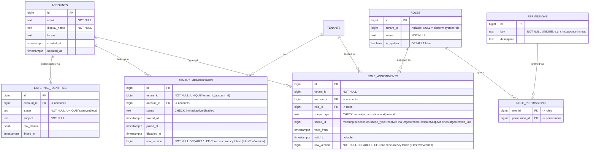

# Identity + Access schema (PostgreSQL, `identity`/`access` schemas)

Physical schema decided in `docs/architecture-analysis/19_IDENTITY_ACCESS_AND_DEALER_NETWORK.md`
(in the research project, sibling to this repo). Revision 3 — EF Core entities, `AccessDbContext`
and configurations written (`src/Modules/Access/`); no migration yet (needs `dotnet ef migrations
add`, not hand-written per AGENTS.md).

**Tenant network tables moved out.** `NETWORKS` and `TENANT_NETWORK_MEMBERSHIPS` no longer live in
this file — they were never Identity/Access's tables, only referenced by `role_assignments.scope_type
= 'network'`. See `docs/schema/tenant-network-schema.md`. The ERD below loses that cross-file edge;
that's the accepted cost of not pre-deciding which module owns the tenant-network relationship.

## Diagram

## Design notes

### Account is the one deliberate exception to mandatory `tenant_id`
`08_MODULAR_MONOLITH_BOUNDARIES.md`'s global rule (research project, sibling to this repo) forbids "no tenant-free repository method for tenant records." `accounts` is not tenant-owned business data — it is the identity a `tenant_membership` row points at. Every other table here that carries `tenant_id` enforces it per the same convention CRM uses (tenant-safe composite FKs, RLS with `FORCE ROW LEVEL SECURITY`, tested against the unprivileged runtime role).

### Role is never a column on `tenant_memberships`
Membership (are you in this tenant, and are you active/invited/disabled) and authorization (what can you do, and where) are different questions with different lifecycles — matching GitLab/Sentry's two-tier role model (org-level + narrower project/team-level) referenced in `19_IDENTITY_ACCESS_AND_DEALER_NETWORK.md` §2.

### `scope_type = 'network'` is how cross-dealer access is granted — never a backdoor into a dealer's own schema
A manufacturer employee's `role_assignment` with `scope_type = 'network'` only grants rights to query Analytics' governed data product for that network (see the decision file §6) — it carries no OLTP read path into any dealer tenant's own tables. This must never be implemented as a cross-schema query shortcut. `scope_id` in that case is a `network_id` from `tenant-network-schema.md`, referenced by value only — no FK across the module boundary, same `EntityRef`-style convention as `PrincipalRef` below.

### Concurrency token — added in Revision 2, was an omission not a decision
Revision 1 left `tenant_memberships` and `role_assignments` without a concurrency token. That was a gap, not a deliberate exclusion: this codebase already has a generic mechanism (`IHasRowVersion` + `RowVersionInterceptor`, built for CRM) — apply it uniformly to every mutable entity here rather than deciding table-by-table. Both tables now carry `row_version`.

**Revision 3 correction:** "reuses the existing mechanism" turned out to mean the *marker interface* only, not the interceptor class. `CRM.Persistence.IHasRowVersion` referenced EF Core nowhere, but doc 08's Contracts row forbids "no ORM, I/O, policy evaluation or service locator" in `Contracts` — and `RowVersionInterceptor : SaveChangesInterceptor` *is* an EF Core dependency, so it cannot move there. Landed as: `Contracts.IHasRowVersion` (bare marker, no ORM reference, shareable) plus one `RowVersionInterceptor` per module (`CRM.Persistence.RowVersionInterceptor`, `Access.Persistence.RowVersionInterceptor` — identical code, deliberately duplicated, not shared, since a module may reference `Contracts` only, never another module's namespace, AGENTS.md).

This is a **different mechanism** from Access's "decision epoch" (doc 08's "decision metadata/epochs" line): `row_version` protects a single row from a lost update; a decision epoch is a separate, still-undesigned counter for invalidating cached `Authorize()` results whenever *any* grant changes. Do not conflate the two when Access gets real code.

### `role_assignments.account_id` has no FK, even though it's the same assembly as `accounts`
`role_assignments` lives in the `access` schema, `accounts` in `identity`. The Identity+Access merge is an assembly-level pilot exception "with explicit internal ownership" (doc 08 §2) — not a promise the schema boundary stays fused. A real FK across `access` → `identity` would work today but block splitting them later, exactly what doc 07 §3 warns against for cross-schema FKs. Treated as a cross-module reference instead: plain `bigint` + a `(tenant_id, account_id)` index, no FK, same convention as `PrincipalRef`/`EntityRef` elsewhere. Every *other* FK in this schema stays real, because every other reference is same-schema (`identity` → `identity` or `access` → `access`).

### Namespace layout, Revision 3
`src/Modules/Access/Domain/Identity/` (`Account`, `ExternalIdentity`, `TenantMembership`) and `Domain/Authorization/` (`Role`, `Permission`, `RolePermission`, `RoleAssignment`) — named `Authorization`, not `Access.Domain.Access`, to avoid the stutter; `Persistence/AccessDbContext.cs` owns both schemas with `Persistence/Configurations/*` split one file per entity, matching CRM's layout.

### `PrincipalRef` mapping
`external_identities.(issuer, subject)` is the physical backing for `Contracts/PrincipalRef.cs`, already committed. CRM's `opportunities.assigned_principal_issuer/subject` (Revision 3, `crm-sales-schema.md`) references this pair with no FK, per the `EntityRef`/cross-module-reference convention — Identity/Access owns this table, CRM never joins to it directly.

**Amendment (Revision 2 review):** `ix_opportunities_tenant_id_assigned_principal_subject` (CRM migration `20260914063206_InitialCrmSchema.cs`, line 285) indexes `(tenant_id, assigned_principal_subject)` — `assigned_principal_issuer` is missing. `PrincipalRef.cs`'s own doc comment states identity is the `(issuer, subject)` *pair*; an index on subject alone contradicts the primitive it indexes. Checked the other two principal-bearing tables in the same migration: `idempotency_records`' primary key is already the composite `(tenant_id, principal_issuer, principal_subject, operation, idempotency_key)` — issuer is already in the key, no gap. `evidence_records` has no principal-based index at all (only `correlation_id` and `tenant_id/aggregate_type/aggregate_id`) — no gap either. Only `opportunities` needs fixing. Since Revision 3's migration is already committed, this is a **new migration** (add `assigned_principal_issuer` to the existing index, or drop and recreate it as a 3-column index), not an edit to the committed migration file.

### Not yet designed here
- Auth session/cookie table shape for the BFF pattern (decision file §3) — this document covers persistent identity/access data, not session state.
- `delegations` and `sod_rules` tables (decision file §2) — named but not column-designed yet; deferred until a concrete delegation/SoD scenario is scoped.
- Decision evidence for `ExplainDecision` — reuses CRM's `evidence_records` pattern (decision file §2); no Access-specific evidence table designed yet.
