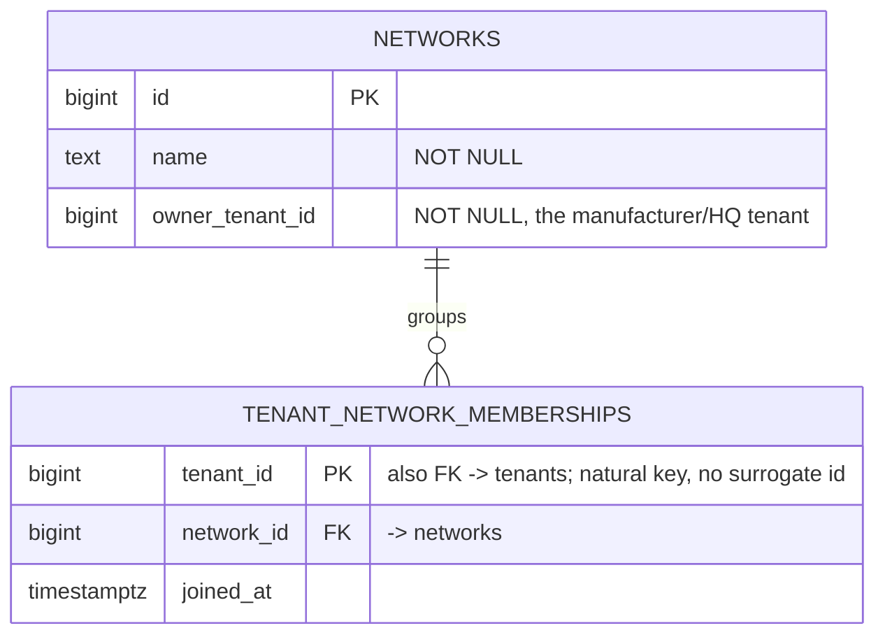

# Tenant network schema (module owner not yet assigned)

Split out of `identity-access-schema.md` on review: these tables are not owned by Identity or
Access, only referenced by them (`role_assignments.scope_type = 'network'`). Decided in
`docs/architecture-analysis/19_IDENTITY_ACCESS_AND_DEALER_NETWORK.md` §7 (research project,
sibling to this repo). **Which module/assembly formally hosts this pair is explicitly left open**
in that decision — do not assign it while implementing something else. This document fixes the
physical shape only.

## Diagram

## Design notes

### `tenant_id` is the primary key, not a surrogate `id`
Nothing joins to this row by id, and a tenant belongs to at most one network — the natural key
*is* the lookup. Same precedent already established in this codebase: CRM's `idempotency_records`
(Revision 3, `crm-sales-schema.md`) uses a composite natural key with "no surrogate id, since the
natural key is the lookup." Same reasoning applies here with a simpler, single-column natural key.

### Owns zero business data
Per the decision file §7, this pair exists only to answer "which network does this tenant belong
to." Three consumers reference it, none of which live here:
- **Analytics** — routes a dealer tenant's published domain facts into its network's data product
- **Access** — `role_assignments.scope_type = 'network'`, `scope_id = network_id`
- **Entitlements** — resolves which external contract funds a given tenant's subscription

### Not an extension of Tenant Lifecycle or Organization
Tenant Lifecycle's row is explicitly forbidden from owning "Organization hierarchy" (doc 07), and
Organization's hierarchy is scoped to legal entities *inside* one tenant (doc 08) — neither covers
a relationship *between* tenants. This pair is deliberately separate from both, matching external
precedent (AWS Organizations, GitHub Enterprise accounts, Stripe Connect, Azure Management Groups
— all keep "parent groups many isolated child accounts" as its own construct, never bolted onto
core account/tenant provisioning; see decision file §7 for sources).

### Not yet designed here
- Which module/assembly hosts this schema — the one open question from the decision file.
- Suspension fan-out when one `owner_tenant_id`'s contract funds every member tenant (decision
  file §5) — flagged, not designed.
- No commands/events named yet (e.g. `AddTenantToNetwork`) — this file is the physical shape only.
